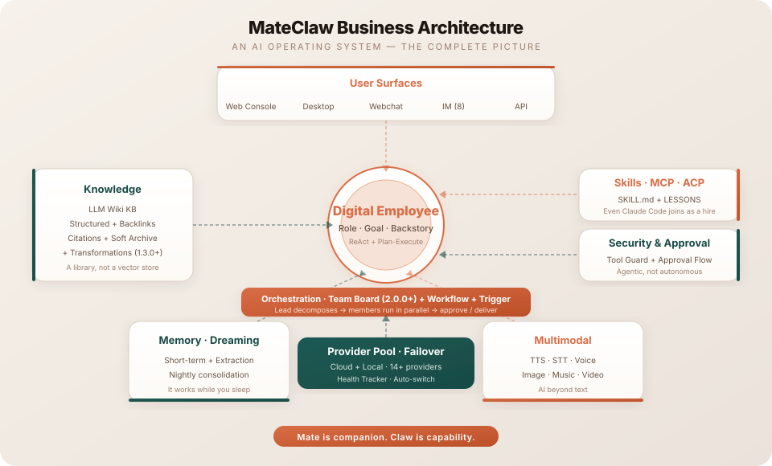
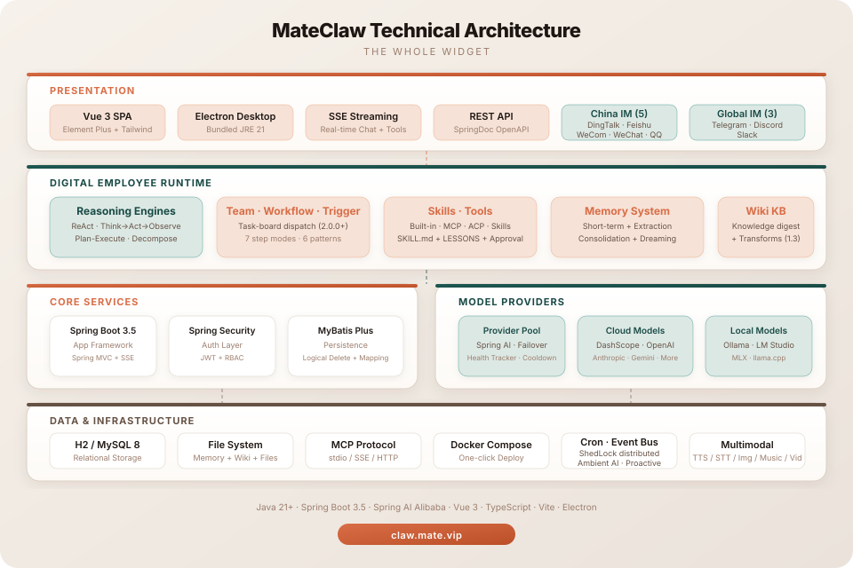

<div align="center">

<p align="center">
  
</p>

# MateClaw

<p align="center"><b>Your second brain</b></p>

<p align="center"><sub><b>Agent Harness · Spring Boot inside · One JAR to ship</b></sub></p>

[](https://github.com/mateaix/mateclaw)
[](https://claw.mate.vip/docs)
[](https://claw-demo.mate.vip)
[](https://claw.mate.vip)
[](https://adoptium.net/)
[](https://spring.io/projects/spring-boot)
[](https://vuejs.org/)
[](https://github.com/mateaix/mateclaw)
[](LICENSE)

[[Website](https://claw.mate.vip)] [[Live Demo](https://claw-demo.mate.vip)] [[Documentation](https://claw.mate.vip/docs)] [[中文](README_zh.md)]

</div>

<p align="center">
  
</p>

---

> **Latest stable: v2.1.0 — Team Runs, closed skill evolution, and replayable reasoning.** One team request is now one durable `runId` across Chat, Agents, and Teams; skills can mine recurring requests under explicit controls and restore from snapshots; reasoning, tool calls, and observations can be exported in execution order. Read the [v2.1.0 release notes](https://claw.mate.vip/docs/en/releases/2.1.0).

---

> **Other personal AI agents are built for one person. MateClaw is the one your IT department can actually sign off on.**
>
> Multi-user workspaces. Approval-gated sensitive actions. Full audit trail. Spring Boot Actuator health monitoring. Per-channel error isolation so one chat platform's outage doesn't take down the rest. One JAR in your environment; you control persisted data, and task content is sent only to model, channel, or tool services you explicitly configure.
>
> **And underneath, a real agent harness.** ReAct + Plan-and-Execute on a StateGraph runtime — not a one-shot RAG call dressed up. Tools, Skills, MCP, and ACP converge on one registry with per-employee binding. Sensitive tool calls flow through an approval gate you can actually inspect. Multi-vendor failover keeps the loop running when a provider doesn't.

Most AI tools die when their vendor has a bad day. Most forget you the moment the tab closes. Most give you a chatbox and call it a product.

**MateClaw is the whole widget.** One deployment. Reasoning, knowledge, memory, tools, channels — built together, not bolted on. And when your primary model is unavailable, the next healthy provider retries the current request.

---

## Three things that make it different

### 1 · Your AI doesn't die when a model does

Primary key expired. Vendor returns 401. Network blip. Quota drained.

Other tools hand you a red error card. MateClaw tries the next healthy provider in configured order — including built-in and OpenAI-compatible options such as DashScope, OpenAI, Anthropic, Gemini, DeepSeek, Kimi, Ollama, LM Studio, and MLX — and attempts to recover the current request. It returns an error only when the available chain is exhausted. A provider health tracker parks bad vendors in a cooldown window so they don't waste seconds on every turn.

You don't write a retry script. You drag providers into priority order in **Settings → Models** and watch the health dashboard fill with green dots as requests route around failures in real time.

### 2 · Knowledge that links itself

Upload a PDF, a batch of markdown, a scraped page — raw material in.

MateClaw's **LLM Wiki** digests it into structured pages, builds `[[links]]` between them, and preserves traceable citations for generated content. Open the citation drawer to inspect the corresponding source chunk and verify page or answer references.

This is the difference between a warehouse and a library.

### 3 · One product, five surfaces

| Surface | What it is |
|---|---|
| **Web Console** | Full admin — digital employees, models, skills, knowledge, security, cron, **runtime console** (see what every employee is doing, force-recycle in one click) |
| **Desktop** | Electron app with a bundled JRE 21. Double-click, run. No Java install |
| **Webchat Widget** | One `<script>` tag embed. Drop it on any site |
| **IM Channels** | DingTalk · Feishu · WeChat Work · WeChat · Telegram · Discord · QQ · Slack |
| **Plugin SDK** | Java module for third-party capability packs |

Same brain. Same memory. Same tools. Different doors.

<p align="center"><b>$0 · No tokens metered. No seats billed. Your server. Your data. Your keys.</b></p>

---

## What's in the box

### Digital employees, not chatbots
You hire coworkers, not chat boxes. Each one has a **Role**, a **Goal**, a **Backstory**, a pixel-art avatar, and a color of their own — six built-in templates ship ready (General Assistant · Product Assistant · Research Analyst · Customer Support · Data Analyst · Code Reviewer). **ReAct** drives iterative reasoning, **Plan-and-Execute** decomposes complex multi-step work, employees can delegate to one another in parallel. Dynamic context pruning, smart truncation, stale-stream cleanup — the boring stuff that makes long conversations actually work.

### Team Runs (2.1.0+)
One request, one durable **Team Run**. A stable `runId` links the user's objective, task DAG, worker executions, final synthesis, and deliverables. Chat is the outcome surface, Agents Live groups the workers for real-time observation, and Teams owns history and governance — all three consume the same server projection. Worker conversations no longer flood the normal sidebar; summaries and files lead, while tasks, evidence, approvals, and read-only worker records drill down on demand. Underneath, the 2.0 shared board still provides dependency orchestration, parallel dispatch, prerequisite hand-off, execution leases, cancel-interrupt, and human approval gates.

### Knowledge & memory
- **LLM Wiki** — raw materials digest into linked pages with citations; the **hot cache** auto-injects into every employee's system prompt. **Transformations engine** (1.3.0+) turns the Wiki from a search index into a processing pipeline
- **Workspace memory** — `AGENTS.md`, `SOUL.md`, `PROFILE.md`, `MEMORY.md`, daily notes
- **Memory lifecycle** — post-conversation extraction, scheduled consolidation, Dreaming workflows. Workflows can also write directly into an employee's `MEMORY.md` via the `write_memory` step

### Skills · MCP · ACP — three ways to extend capability
- **SKILL.md packages** — manifest + prompt + tool list + **LESSONS.md**. In 2.1, reflection and cross-session recurring-request mining can produce reusable improvements; routine promotion, constrained auto-binding, curator handover/governance, origin policy, snapshots, and restore points keep evolution observable, workspace-scoped, and reversible. Eight starter templates plus a five-step creation wizard, with **Pre-flight checks** before install
- **MCP** — stdio / SSE / Streamable HTTP, plug into any external tool server. **Per-employee binding** (1.3.0+) means a tool you install for one employee doesn't bleed into another's toolbox
- **ACP** — bring top-tier coding agents like Claude Code and Codex in as employees, auto-bridged to skill cards with wrapper tools
- **Tool Guard** — RBAC + approval flow + path protection. Capability needs boundaries

### Business orchestration (1.3.0+)
- **Workflow** — compose multiple employees plus system actions (approval / channel dispatch / write-memory) into a publishable, triggerable, replayable linear DSL. Seven step modes (`sequential` / `fan_out` / `collect` / `conditional` / `await_approval` / `dispatch_channel` / `write_memory`). JSON-first authoring with Monaco + schema validation, or natural-language → draft generation
- **Triggers** — wire system events to workflows or to employee conversations. Six pattern types (`cron` / `webhook` / `channel_message` / `agent_lifecycle` / `content_match` / `workflow_completion`). Default-on event governance: dedup, per-trigger rate limit, bot-self filter, recursion guard, fail-closed unknown patterns
- **Wiki Transformations** — Wiki stops being retrieval-only. User-authored templates run against raw materials or existing pages, with cross-material map-reduce aggregation, reverse-citation extraction, JSON output mode, and per-template model picker

### You see what every employee is doing
**Admin Runtime Console** (`Settings → System → Runtime`) — who's running, what step they're on, how many tokens, one-click force-recycle when stuck. Streaming is staged honestly (thinking / tool / answer), each reasoning iteration keeps its real position and wall-clock duration, and linear trajectory export lays out reasoning, calls, observations, and answers for review. Per-event SSE IDs make reconnects safe; Team Runs group member work under one live execution.

### Multimodal creation
Text-to-speech · Speech-to-text · Image · Music · Video · 3D. First-class, not add-ons. **Sidecar routing** (1.3.0+) means a text-only main model + an image attachment no longer dead-ends — a configured vision model describes the image, and the main model answers. **Image edit** lands too: refer to an earlier conversation attachment by `msg:<id>:<idx>` and ask the model to recolor or restyle it. Four **document-generation tools** (`DocxRenderTool` / `XlsxRenderTool` / `PptxRenderTool` / `PdfRenderTool`) render Markdown straight to Office files inside the JVM — no subprocess, no Office install.

### Content Studio (1.8.0+)
A flagship *scene*, not a tool — a seeded "Content Studio" employee turns one sentence into a publishable post: pick-topic → research → draft → illustrate → **de-AI** → lay out → deliver. **WeChat Official Account (公众号)** articles land in your draft box as inline-style HTML with body images uploaded into WeChat; **Xiaohongshu (小红书)** notes package as ≥3 vertical 3:4 cards with an online preview. De-AI-ification runs against a **measurable AI-trace score**; every delivery is compliance-scanned and logged to a **content calendar** that dedups by topic fingerprint.

### Enterprise-ready
RBAC + JWT. **Personal Access Tokens** for headless scripts and CI. **HMAC-SHA-256 outbound webhook signing**. **Distributed Cron lock** so multi-instance deployments don't double-fire. Full audit trail. Flyway-managed schema. One JAR to ship. H2 for development; the public Docker stack defaults to PostgreSQL 16, the MySQL profile remains supported, and the Kingbase driver is opt-in.

---

## AI is becoming infrastructure

Model providers rate-limit, networks fail, keys expire, and services become temporarily unavailable. Betting every AI capability on one provider turns an upstream incident into your own outage.

Once AI enters production, the stable layer should not be tied to one supplier. MateClaw absorbs that uncertainty into one runtime through provider priorities, health tracking, cooldown, and failover.

**MateClaw is that layer — built the Spring Boot way.**

---

## Why MateClaw

| | MateClaw | [OpenClaw](https://github.com/openclaw/openclaw) | [Hermes Agent](https://github.com/NousResearch/hermes-agent) | [Claude Code](https://github.com/anthropics/claude-code) | [Cursor](https://cursor.com) |
|:---|:---:|:---:|:---:|:---:|:---:|
| **Multi-vendor failover** | **Chain + health tracker + cooldown** | Swap providers via config | Orchestration w/ retry | Anthropic only | One model |
| **Knowledge digestion** | **LLM Wiki + page-level citations** | Canvas + memory | Skills Hub + memory | — | Code index |
| **Multi-user admin** | **RBAC + approval + audit + runtime console** | Config-file first | Single-user CLI | Enterprise tier | Teams plan |
| **Capability extension** | **Skills (LESSONS) + MCP + ACP** | — | — | MCP | MCP |
| **Surfaces** | Web admin + Desktop + Widget + SDK + 8 IM | 25+ chat channels | 15+ channels (CLI-led) | 3 IM preview | IDE only |
| **Stack** | **Java (Spring Boot)** | TypeScript | Python | TypeScript | Electron/TS |
| **License / Price** | **Apache 2.0 · Free** | MIT · Free | MIT · Free | Proprietary · $20–200/mo | Proprietary · $0–200/mo |

**OpenClaw and Hermes Agent are excellent personal AI platforms** — pick either if you're running one user on one laptop, building your own agent from CLI, and treating everything as config files to hand-tune. Both have bigger communities than MateClaw today.

**MateClaw is the version built for teams.** Digital employees, models, and tools sit behind permissions and workspace boundaries. Approval flows can pause risky actions for review, and key operations enter the audit trail. The Admin Runtime Console centralizes active employee and provider state with force-recycle for stuck runs. Spring Boot inside — a natural fit for Java shops already running production services.

Same "whole widget" philosophy. Different center of gravity.

---

## Quick start

```bash
# Backend
cd mateclaw-server
mvn spring-boot:run           # http://localhost:18088

# Frontend
cd mateclaw-ui
npm install && npm run dev    # http://localhost:5173
```

Login: `admin` / `admin123`

### Docker

```bash
cp .env.example .env
docker compose up -d          # http://localhost:18080
```

### Desktop

Download from [GitHub Releases](https://github.com/mateaix/mateclaw/releases). Bundles JRE 21. No Java install needed.

---

## Architecture

<p align="center">
  
</p>

<details>
<summary><b>Technical architecture</b></summary>
<p align="center">
  
</p>
</details>

---

## Project structure

```
mateclaw/
├── mateclaw-server/        Spring Boot 3.5 backend (Spring AI Alibaba, StateGraph runtime)
├── mateclaw-ui/            Vue 3 + TypeScript admin SPA (built into the server JAR)
├── mateclaw-desktop/       Electron desktop app (local-embedded / remote-centralized)
├── mateclaw-webchat/       Embeddable chat widget (UMD / ES bundles)
├── mateclaw-plugin-api/    Java SDK for third-party capability plugins
├── mateclaw-plugin-sample/ Reference plugin implementation
├── mateclaw-plugin-mem0/   Optional Mem0 memory-provider plugin
├── mateclaw-plugin-search-sample/ Search Provider SPI example
├── docker-compose.yml
└── .env.example
```

Desktop binaries ship via [GitHub Releases](https://github.com/mateaix/mateclaw/releases) with a bundled JRE 21 — no Java install needed.

## Tech stack

| Layer | Technology |
|---|---|
| Backend | Spring Boot 3.5 · Spring AI Alibaba 1.1 · MyBatis Plus · Flyway |
| Digital Employee Runtime | StateGraph · ReAct + Plan-Execute · Role / Goal / Backstory · closed skill evolution · Team Run + shared task board (2.1.0+) |
| Orchestration | Workflow (7 step modes · Pebble DSL) · Triggers (6 pattern types · event governance) · Wiki Transformations (1.3.0+) |
| Capability Extension | SKILL.md packages · MCP (stdio / SSE / HTTP · per-agent binding) · ACP bridge (Claude Code / Codex) |
| Database | H2 (dev) · PostgreSQL 16 (Docker default) · MySQL 8.0+ (supported) · Kingbase (opt-in driver) |
| Auth | Spring Security + JWT |
| Frontend | Vue 3 · TypeScript · Vite · Element Plus · TailwindCSS 4 |
| Desktop | Electron · electron-updater · JRE 21 (bundled) |
| Widget | Vite library mode · UMD + ES bundles |

---

## Documentation

Full docs at **[claw.mate.vip/docs](https://claw.mate.vip/docs)** — setup, architecture, each subsystem, API reference.

## Roadmap

**v2.1.0 (shipped 2026-08-15)** — from “a board full of tasks” to **one governable team run**:

- **Unified Team Runs** — one `runId` links request, task DAG, worker conversations, events, final synthesis, and deliverables; Chat delivers outcomes, Agents observes live work, Teams governs history
- **Closed skill evolution** — reflection + recurring-request mining + promotion + constrained auto-binding + curator governance + snapshots/restore, conservative by default and isolated per workspace
- **Replayable execution** — live `<think>` extraction, every reasoning iteration in emission order with real duration, superseded narration, and linear trajectory export
- **Capabilities reach operations** — proactive IM push, targeted Cron delivery, model-specific context windows, progressive tool disclosure, and tool-backed action completion
- **Reliability pass** — hardened browser refs/navigation/waits, WebChat/SSE cleanup and upstream idle timeout, Feishu progress, Qwen3-ASR HTTP, batch session deletion, date-partitioned files, and safe 64-bit ids

Full story in the [v2.1.0 release notes](https://claw.mate.vip/docs/en/releases/2.1.0).

**v2.0.0 (shipped 2026-07-31)** — from "one person who gets things done" to "a team that collaborates": **Agent Teams** become a standing roster around a shared task board:

- **Agent teams and a shared task board** — teams / roles (lead · member · reviewer), an eight-status kanban, `blockedBy` dependency orchestration, member-level parallel dispatch, automatic prerequisite hand-off, settled results waking the lead; the Teams page ships an event-driven live board + activity banner + task timelines + deliverable downloads + manual task creation
- **An execution chain hardened for long tasks** — execution leases + runtime heartbeats against double execution, cancel that actually interrupts, `in_review` approval gates, retry for failed/stale
- **Plan-Execute plans hand over to the board** — steps become tasks, dependencies become parallelism, a parked-plan resume gate synthesizes deterministically
- **Workspace isolation fully sealed** — channel-scoped conversation ids; same-named skills coexist per workspace with conversation-scoped runtime resolution
- **Channel experience** — magic commands on every channel (`/new` `/clear` `/status` `/stop` `/model` `/help`), WeCom's event-driven progress bubble (live tool trace + per-stage rolling narration)
- **Server-side rewind / regenerate** · **explainable auto-approval misses** (reason codes on audit rows + one-click grant creation) · **policy-driven LLM error recovery** (overload vs rate-limit split · `Retry-After`-aware backoff · provider TTL readmission)

Plus: in-chat attachment preview (pdf / docx / xlsx / html / text), single-source SKILL.md + console bundle-file management, the optional Mem0 plugin memory provider, and the knowledge-graph relation schema whitelist.

Full story in the [v2.0.0 release notes](https://claw.mate.vip/docs/en/releases/2.0.0).

**v1.8.0 (shipped 2026-07-12)** — the employee turns *outward and does a whole job*: **Content Studio**, the first flagship scene built end-to-end on MateClaw's own primitives:

- **Content Studio — one sentence to a publishable post** — a seeded "Content Studio" employee runs pick-topic → research → draft → illustrate → de-AI → layout → deliver. **WeChat Official Account (公众号)** image-text articles (inline-style HTML → draft box) and **Xiaohongshu (小红书)** image-first notes (≥3 vertical 3:4 cards + online preview) ship first-class
- **De-AI-ification you can measure** — a heuristic AI-trace score (no LLM, deterministic) drives a detect → rewrite → re-check loop, capped at 3 rounds
- **A publish chain hardened for real operation** — body images uploaded into WeChat (no broken external links), AES-GCM-encrypted secrets, reused service + persisted token, retry + Chinese error hints, a guaranteed fallback cover; draft-box-first, publish approval-gated
- **A content calendar that dedups and remembers** — every delivery is compliance-scanned and auto-recorded, a topic fingerprint stops repeat picks, and a read-only Content Calendar page shows drafted/packaged/published/failed
- **The browser agent sees by reference** — an accessibility-tree ref snapshot + interact-by-ref (click the element, not a pixel), real-browser privacy guardrails, and a controlled CDP escape hatch
- **Sharper attention, tighter loops** — attention anchoring & environment awareness (MCP tool provenance + pinned skill constraints + event notifications), a tool-call loop guard, and a post-mutation verify reminder

Plus: a fast-load pass (initial load down ~78%), a chat context-occupancy panel, cross-KB wikilinks, MCP progress notifications, a Volcano Engine provider, and the public Docker stack on PostgreSQL 16.

Full story in the [v1.8.0 release notes](https://claw.mate.vip/docs/en/releases/1.8.0).

**v1.7.0 (shipped 2026-07-04)** — a *productionization pass*: once it's in real collaboration, close every loop you can't see, gather, reach, fit, or connect:

- **All three approval paths close the loop** — workflow `await_approval` actually pushes to channels and resolves → resumes, the WebChat (API-key) channel can approve/deny and replay, and Feishu/WeCom card clicks resolve workflow approvals directly
- **Long tasks are visible** — an always-on Run Overview rail + a per-turn token breakdown (cache hit/miss/write + reasoning split) + sub-agent cost rolled up + one-click generated-file download
- **Fits the real model window** — local-model context-window probing, a unified token budget for prefix injection, small-context degradation, and tool-schema budget gating — no more "guess 32K" pre-flight rejections or silent truncation
- **Opens up** — a knowledge-base + Deep Research open API (API-key + rate limit + SSE), a pluggable search Provider SPI, and MCP identity forwarding (carry the authenticated user's identity into a STDIO MCP)
- **Reaches further** — desktop local-embedded / remote-centralized dual mode (with `mateclaw-desktop` source opened) + a LAN deployment mode for controlled intranet access
- **One-click operational data export** — Dashboard 9-sheet Excel + a CLI for offline export

Full story in the [v1.7.0 release notes](https://claw.mate.vip/docs/en/releases/1.7.0).

**v1.6.0 (shipped 2026-06-22)** — make the autonomous employee *fast, sharp-eyed, and embeddable*: two-stage skill loading + prefix compression (faster first token) · `execute_code` native sandboxed code execution · vision that persists across turns + `image_analyze` · embeddable/headless webchat with per-`endUserId` memory · a Wiki you actually read (reading split from management · unified Sources tab · clickable `[[wikilinks]]`) · steadier under load (self-healing MCP · tool-call recovery · evidence-gated plans). Full story in the [v1.6.0 release notes](https://claw.mate.vip/docs/en/releases/1.6.0).

**v1.5.0 (shipped 2026-06-04)** — Goal checklists (fuzzy score → ticked boxes) · self-maintaining Wiki (`[[wikilinks]]` · fact/experience layers · pageType profiles & permissions · KB pipelines · local-directory ingest) · per-owner memory isolation (`owner_key` + visibility scope + `endUserId` passthrough) · per-agent primary knowledge base · provider-preference model routing. Full story in the [v1.5.0 release notes](https://claw.mate.vip/docs/en/releases/1.5.0).

**v1.4.0 (shipped 2026-05-23)** — Persistent Goals (lock a goal, self-evaluate every turn) · subagent delegation tree (3 levels deep · sync / parallel / async · one-sentence team builder) · progressive tool/skill disclosure · Workspace RBAC (Owner / Admin / Member / Viewer) · Feishu first-class (interactive / approval / streaming cards · channel-native tools). See the [v1.4.0 release notes](https://claw.mate.vip/docs/en/releases/1.4.0).

**v1.3.0 (shipped 2026-05-13)** — Workflow engine · 6-pattern trigger system · Wiki transformations · per-agent MCP binding · multimodal sidecar routing · four JVM-native document-generation tools · image edit. See the [v1.3.0 release notes](https://claw.mate.vip/docs/en/releases/1.3.0).

## Contributing

```bash
git clone https://github.com/mateaix/mateclaw.git
cd mateclaw
cd mateclaw-server && mvn clean compile
cd ../mateclaw-ui && npm install && npm run dev
```

---

## Why the name

**Mate** is companion. **Claw** is capability.

Something that stays with you — and grabs work and moves it.

## License

[Apache License 2.0](LICENSE). No asterisks.
