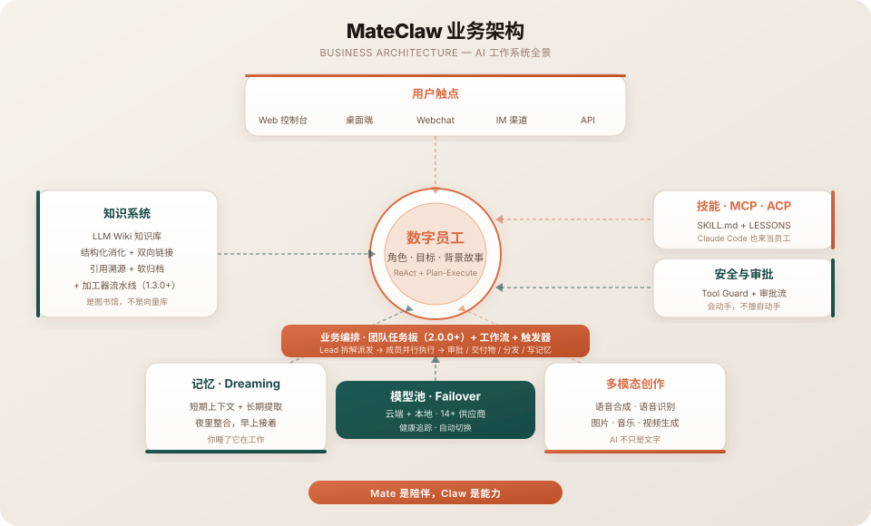
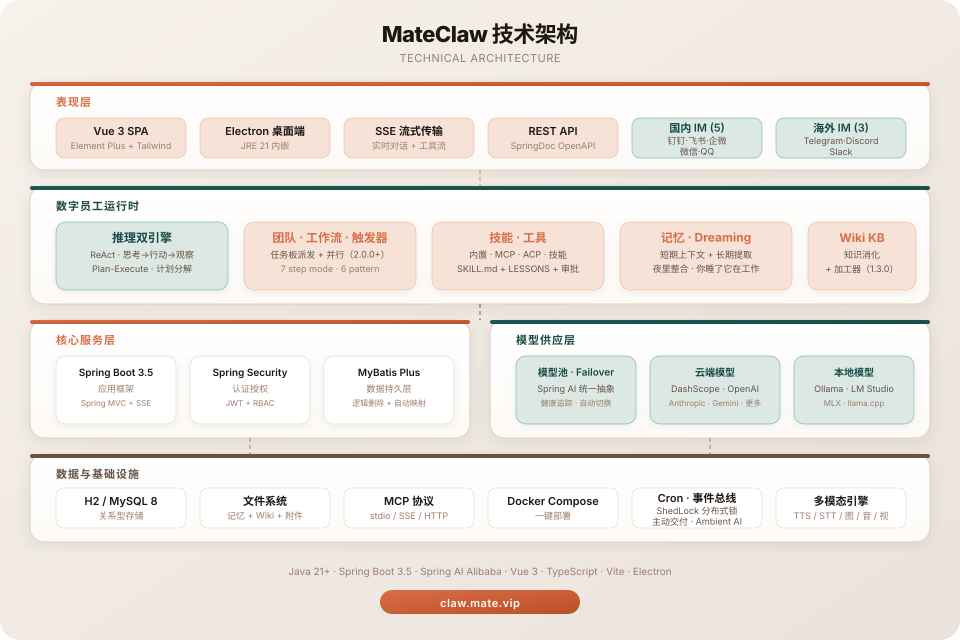

<div align="center">

<p align="center">
  
</p>

# 太一（MateClaw）

<p align="center"><b>你的超级大脑</b></p>

<p align="center"><sub><b>Agent Harness · Spring Boot 内核 · 一个 JAR 交付</b></sub></p>

[](https://github.com/mateaix/mateclaw)
[](https://claw.mate.vip/docs)
[](https://claw-demo.mate.vip)
[](https://claw.mate.vip)
[](https://adoptium.net/)
[](https://spring.io/projects/spring-boot)
[](https://vuejs.org/)
[](https://github.com/mateaix/mateclaw)
[](LICENSE)

[[官网](https://claw.mate.vip)] [[在线演示](https://claw-demo.mate.vip)] [[文档](https://claw.mate.vip/docs)] [[English](README.md)]

</div>

<p align="center">
  
</p>

---

> **最新稳定版：v2.1.0 —— Team Run、Skill 自进化闭环与可回放执行。** 一次团队请求现在以一个持久化 `runId` 贯穿 Chat、Agents 与 Teams；技能可在显式开关和工作空间隔离下发现重复请求、晋升并从快照恢复；推理、工具调用、观察与回答可按执行顺序导出。详见 [v2.1.0 更新记录](https://claw.mate.vip/docs/zh/releases/2.1.0)。

---

> **别的 AI 助手是给一个人用的。MateClaw 是公司允许部署的那一个。**
>
> 多用户工作空间。敏感操作走审批。完整审计日志。Spring Boot Actuator 健康监控。单个渠道挂掉不影响其他渠道的错误隔离。一个 JAR 包跑在自己的环境里；持久化数据由你掌控，任务所需内容只会发送到你主动配置的模型、渠道或工具服务。
>
> **底下是个真 agent harness。** ReAct + Plan-and-Execute 跑在 StateGraph 运行时上——不是一次 RAG 调用披件外套。工具 · 技能 · MCP · ACP 收敛进同一个注册表，每位员工独立绑定。敏感工具调用走可审计的审批闸门。多厂商故障转移让循环在某家供应商挂掉时也不停。

大多数 AI 工具一到厂商抽风那天就两手一摊。关一次标签页就忘了你是谁。给你一个聊天框，就敢叫产品。

**MateClaw 是完整的一整套。** 一次部署——推理、知识、记忆、工具、多渠道入口，从第一天就一起设计，不是事后拼接。主模型不可用时，系统会按优先级改由下一家健康供应商重新完成当前请求。

---

## 三件让它与众不同的事

### 1 · 模型挂了，AI 不挂

Key 过期。厂商返回 401。网络抖动。配额耗尽。

别的工具丢你一张红色错误卡。MateClaw 会按配置顺序尝试下一家健康供应商——DashScope、OpenAI、Anthropic、Gemini、DeepSeek、Kimi、Ollama、LM Studio、MLX 等内置或 OpenAI 兼容供应商——尽可能恢复当前请求；仅当可用链路全部失败时才返回错误。内置的 **Provider Health Tracker** 会把连续失败的供应商放进冷却窗口，避免每一轮对话都白白撞壁。

你不用写重试脚本。在 **设置 → 模型** 里把供应商拖成你想要的优先顺序，健康面板实时亮起一排绿点——请求绕着故障流过去。

### 2 · 知识会自己长出链接

上传 PDF、一批 markdown、抓下来的网页——原始材料进去。

MateClaw 的 **LLM Wiki** 把它消化成结构化页面，页面之间自己长出 `[[链接]]`，生成内容保留可追踪引用。点开引用抽屉，就能看到对应的原始 chunk；页面与回答中的引用可以回到来源核对。

这是**仓库**和**图书馆**的区别。

### 3 · 一个产品，五个入口

| 入口 | 它是什么 |
|---|---|
| **Web 控制台** | 完整的管理后台——数字员工、模型、技能、知识、安全、定时任务、**运行时控制台**（看见每位员工正在干什么、一键回收） |
| **桌面端** | Electron + 内嵌 JRE 21，双击即用，无需装 Java |
| **网页嵌入式聊天** | 一个 `<script>` 标签就能嵌进任何网站 |
| **IM 渠道** | 钉钉 · 飞书 · 企业微信 · 微信 · Telegram · Discord · QQ · Slack |
| **插件 SDK** | Java 模块，供第三方扩展能力包 |

同一个大脑。同一份记忆。同一套工具。不同的门。

<p align="center"><b>$0 · 无 token 计费。无座位收费。你的服务器，你的数据，你的 Key。</b></p>

---

## 盒子里有什么

### 数字员工，不是聊天机器人
你雇佣员工，不是开聊天框。每位有**角色**、**目标**、**背景故事**，像素艺术头像与专属配色——6 个内置模板（通用助手 · 产品助理 · 研究分析师 · 客服助理 · 数据分析师 · 代码审查员）开箱可用。**ReAct** 做迭代推理，**Plan-and-Execute** 做复杂多步任务，员工之间可以并行委派。动态上下文裁剪、智能截断、僵死流清理——让长对话真正能用的那些“不起眼”的基础设施。

### Team Run（2.1.0+）
一次请求对应一个持久化的 **Team Run**。稳定的 `runId` 串起用户目标、任务 DAG、成员执行、最终汇总与交付物。Chat 是成果交付面，Agents Live 按运行聚合成员并展示实时状态，Teams 管理历史与治理；三处读取同一份服务端投影。成员子会话不再挤进普通会话列表，摘要和文件优先展示，任务、证据、审批与只读成员记录按需下钻。底层继续使用 2.0 的共享任务板，保留依赖编排、并行派发、前置结果传递、执行租约、取消中断和人工审批卡点。

### 知识与记忆
- **LLM Wiki** — 原始材料消化成有链接、带引用的结构化页面；**热点缓存**自动注入到员工的 system prompt。**加工器引擎**（1.3.0+）把 Wiki 从"搜索索引"升级为"处理流水线"
- **工作区记忆** — `AGENTS.md` / `SOUL.md` / `PROFILE.md` / `MEMORY.md` / 每日笔记
- **记忆生命周期** — 对话后自动提取 · 定时整理 · Dreaming 工作流。工作流也可以通过 `write_memory` step 直接写进员工的 `MEMORY.md`

### 技能 · MCP · ACP — 三种"接外部能力"的方式
- **SKILL.md 技能包** — 一份 manifest + prompt + 工具列表 + **LESSONS.md**。2.1 可通过对话反思与跨会话重复请求挖掘形成可复用改进，并以候选晋升、受约束自动绑定、curator 治理、来源策略、快照和恢复点保证过程可观察、按工作空间隔离且可回滚；所有自动能力均由独立开关控制。另有 8 个起步模板、5 步创作向导和安装前 **Pre-flight 检查**
- **MCP** — stdio / SSE / Streamable HTTP 三种传输，接入任意外部工具服务器。**每位员工独立绑定**（1.3.0+）——一位员工装的工具不会渗到其他人的工具栏里
- **ACP** — 把 Claude Code、Codex 这种顶级编码 Agent 以"员工"身份接入，桥接成技能卡 + 包装工具
- **Tool Guard** — RBAC + 审批流 + 文件路径保护。能力必须有边界

### 业务流程编排（1.3.0+）
- **工作流（Workflow）** — 把多位员工 + 系统动作（审批 / 渠道分发 / 写记忆）按线性 step DSL 编排成一条可发布、可触发、可重放的业务流程。7 种 step mode（`sequential` / `fan_out` / `collect` / `conditional` / `await_approval` / `dispatch_channel` / `write_memory`）。JSON-first 编辑（Monaco + JSON schema + Pebble 静态检查），或者用一句话生成草稿
- **触发器（Trigger）** — 把"系统里发生的事"自动接到工作流或员工对话上。6 种 pattern type（`cron` / `webhook` / `channel_message` / `agent_lifecycle` / `content_match` / `workflow_completion`）。事件治理默认开：去重、per-trigger 限速、bot 自循环过滤、A→B→A 递归保护、未知 pattern fail-closed
- **Wiki 加工器** — Wiki 不再只是被动检索。用户自定义模板对原料或现有页面跑模板，跨原料 map-reduce 聚合，reverse-citation 绑定到源 chunk，JSON 输出 + 可选 JSON Schema，每个模板独立选模型

### 你看得见每位员工正在干什么
**Admin 运行时控制台**（`后台 → 系统 → 运行时`）——谁在跑、跑到哪一步、占多少 token、卡住了一键回收。流式阶段如实区分思考 / 工具 / 回答；每轮推理保留真实发生顺序，界面显示实际耗时，线性 trajectory 导出则按顺序展开推理、调用、观察与回答。SSE 每事件 ID 支持安全重连，Team Run 将成员工作聚合到同一次运行下。

### 多模态创作
语音合成 · 语音识别 · 图片 · 音乐 · 视频 · 3D。一等公民，不是附加插件。**多模态旁路**（1.3.0+）让纯文本主模型遇到图片附件时自动调用配置好的视觉模型转描述，主对话保持便宜。**图像编辑**也到位：用 `msg:<id>:<idx>` 引用会话里更早的某张图，让模型改色、改风格。**4 个文档生成工具**（`DocxRenderTool` / `XlsxRenderTool` / `PptxRenderTool` / `PdfRenderTool`）在 JVM 内把 Markdown 直接渲染成 Office 文件——不 fork 子进程、不依赖 npm、不需要装 Office。

### 内容工作室（1.8.0+）
一个招牌*场景*，不是工具——预置的「内容工作室」员工把一句话变成可发布成品：选题 → 搜集 → 成文 → 配图 → **去 AI 化** → 排版 → 交付。**微信公众号（公众号）**文章以内联样式 HTML 进入草稿箱，正文图自动上传到微信；**小红书**笔记打包成 ≥3 张竖版 3:4 卡片并在线预览。去 AI 化围绕一个**可度量的 AI 痕迹评分**运行；每次交付都经过合规扫描，并记入按选题指纹去重的**内容日历**。

### 企业就绪
RBAC + JWT。**Personal Access Token** 给无人值守脚本和 CI 使用。**Webhook 出站 HMAC-SHA-256 签名**。**Cron 分布式锁**避免多实例重复执行。完整审计事件流。Flyway 管理数据库 schema。一个 JAR 交付。开发环境可用 H2；公开 Docker 栈默认使用 PostgreSQL 16，同时保留 MySQL profile，Kingbase 驱动为按需启用。

---

## AI 正在变成基础设施

模型供应商会限流，网络会抖动，Key 会过期，服务也可能临时不可用。把所有 AI 能力押在单一供应商上，会让上游故障直接变成自己的业务故障。

当 AI 进入生产环境，稳定的一层不应绑定在一家供应商身上。MateClaw 通过供应商优先级、健康追踪、冷却与故障转移，把这种不确定性收进统一运行时。

**MateClaw 就是那一层——用 Spring Boot 方式盖的。**

---

## 为什么选 MateClaw

| | MateClaw | [OpenClaw](https://github.com/openclaw/openclaw) | [Hermes Agent](https://github.com/NousResearch/hermes-agent) | [Claude Code](https://github.com/anthropics/claude-code) | [Cursor](https://cursor.com) |
|:---|:---:|:---:|:---:|:---:|:---:|
| **多厂商失败转移** | **Chain + 健康追踪 + 冷却** | 切换供应商（改配置） | 内置编排重试 | 仅 Anthropic | 单模型 |
| **知识消化式加工** | **Wiki + 页面级引用溯源** | Canvas + 记忆 | Skills Hub + 记忆 | — | 代码索引 |
| **多用户管理** | **RBAC + 审批流 + 审计 + 运行时控制台** | 配置文件优先 | 单用户 CLI | 企业版 | 团队版 |
| **能力扩展接口** | **技能 (LESSONS) + MCP + ACP** | — | — | MCP | MCP |
| **用户触点** | Web 管理台 + 桌面 + 嵌入 + SDK + 8 IM | 25+ 聊天渠道 | 15+ 渠道（CLI 为主） | 3 IM（预览） | 仅 IDE |
| **技术栈** | **Java（Spring Boot）** | TypeScript | Python | TypeScript | Electron/TS |
| **许可 / 定价** | **Apache 2.0 · 免费** | MIT · 免费 | MIT · 免费 | 闭源 · $20–200/月 | 闭源 · $0–200/月 |

**OpenClaw 和 Hermes Agent 是优秀的个人 AI 平台**——如果你是一个人、一台笔记本、习惯从 CLI 搭自己的 agent、所有东西都靠手工配置文件调优，选它们没问题。两家的社区规模今天都大于 MateClaw。

**MateClaw 是那个给团队用的版本。** 数字员工、模型与工具都纳入权限和工作空间边界。危险动作可暂停等待审批，关键操作进入审计事件流。Admin 运行时控制台集中展示正在执行的员工与供应商状态，卡住时可回收。底座是 Spring Boot，适合并入已有 Java 服务体系。

**同一套"完整一整套"哲学，不同的重心。**

---

## 快速开始

```bash
# 后端
cd mateclaw-server
mvn spring-boot:run           # http://localhost:18088

# 前端
cd mateclaw-ui
npm install && npm run dev    # http://localhost:5173
```

默认登录：`admin` / `admin123`

### Docker 部署

```bash
cp .env.example .env
docker compose up -d          # http://localhost:18080
```

### 桌面端

从 [GitHub Releases](https://github.com/mateaix/mateclaw/releases) 下载安装包。内嵌 JRE 21，无需额外装 Java。

---

## 架构全景

<p align="center">
  
</p>

<details>
<summary><b>技术架构</b></summary>
<p align="center">
  
</p>
</details>

---

## 项目结构

```
mateclaw/
├── mateclaw-server/        Spring Boot 3.5 后端（Spring AI Alibaba · StateGraph 运行时）
├── mateclaw-ui/            Vue 3 + TypeScript 管理 SPA（构建产物打进后端 JAR）
├── mateclaw-desktop/       Electron 桌面端（本地内嵌 / 远程集中双模式）
├── mateclaw-webchat/       网页嵌入式聊天组件（UMD / ES bundle）
├── mateclaw-plugin-api/    第三方能力插件的 Java SDK
├── mateclaw-plugin-sample/ 参考插件实现
├── mateclaw-plugin-mem0/   可选 Mem0 记忆 Provider 插件
├── mateclaw-plugin-search-sample/ 搜索 Provider SPI 示例
├── docker-compose.yml
└── .env.example
```

桌面端安装包通过 [GitHub Releases](https://github.com/mateaix/mateclaw/releases) 分发，内嵌 JRE 21——无需安装 Java。

## 技术栈

| 层次 | 技术 |
|---|---|
| 后端 | Spring Boot 3.5 · Spring AI Alibaba 1.1 · MyBatis Plus · Flyway |
| 数字员工运行时 | StateGraph · ReAct + Plan-Execute · 角色 / 目标 / 背景故事 · Skill 自进化闭环 · Team Run + 共享任务板（2.1.0+）|
| 业务编排 | 工作流（7 step mode · Pebble DSL）· 触发器（6 pattern type · 事件治理）· Wiki 加工器（1.3.0+）|
| 能力扩展 | SKILL.md 包 · MCP（stdio / SSE / HTTP · per-agent 绑定）· ACP 桥接（Claude Code / Codex） |
| 数据库 | H2（开发）· PostgreSQL 16（Docker 默认）· MySQL 8.0+（支持）· Kingbase（按需驱动）|
| 认证 | Spring Security + JWT |
| 前端 | Vue 3 · TypeScript · Vite · Element Plus · TailwindCSS 4 |
| 桌面端 | Electron · electron-updater · 内嵌 JRE 21 |
| Webchat | Vite library 模式 · UMD + ES bundle |

---

## 文档

完整文档 **[claw.mate.vip/docs](https://claw.mate.vip/docs)**——安装、架构、各子系统、API 参考。

## 路线图

**v2.1.0（2026-08-15 发布）** —— 从“一块摆满任务的看板”到**一次可治理的团队运行**：

- **统一 Team Run** —— 一个 `runId` 串起请求、任务 DAG、成员会话、事件、最终汇总与交付物；Chat 交付成果，Agents 观察实时执行，Teams 管理历史与治理
- **Skill 自进化闭环** —— 对话反思、重复请求挖掘、候选晋升、受约束自动绑定、curator 治理、快照与恢复；默认保守、显式控制并按工作空间隔离
- **可回放执行** —— 实时提取内联 `<think>`，每轮推理按发生顺序展示实际耗时，保留被后续工具调用替代的阶段旁白，并可导出线性 trajectory
- **能力进入日常运营** —— 主动 IM 推送、Cron 定向投递、模型级上下文窗口、渐进式工具披露，以及基于实际工具调用结果的行动完成检查
- **可靠性加固** —— 浏览器 ref / 导航 / 等待、WebChat 与 SSE 清理及上游空闲超时、飞书进度、Qwen3-ASR HTTP、会话批量删除、文件按日分区和 64 位 ID 精度保护

完整内容见 [v2.1.0 更新记录](https://claw.mate.vip/docs/zh/releases/2.1.0)。

**v2.0.0（2026-07-31 发布）** —— 从“一个能干活的人”到“一支能协作的队伍”：**Agent 团队**成为常设编制，围绕共享任务板工作：

- **Agent 团队与共享任务板** — 团队 / 角色（lead · member · reviewer）、八状态看板、`blockedBy` 依赖编排、成员级并行派发、前置结果自动传递、结果通报唤醒 Lead；Teams 页事件驱动实时看板 + 活动横幅 + 任务时间线 + 交付物下载 + 手动投任务
- **为长任务加固的执行链** — 执行租约 + 运行期心跳防双重执行、取消即真实中断、`in_review` 审批卡点、失败/过期可重试
- **Plan-Execute 计划整体移交任务板** — 步骤变任务、依赖变并行、停靠恢复门确定性汇总
- **工作空间隔离全面收口** — 渠道会话 id 编入渠道标识、同名技能跨工作空间共存且运行时按会话工作空间解析
- **渠道体验** — 全渠道魔法命令（`/new` `/clear` `/status` `/stop` `/model` `/help`）、企业微信事件驱动进度气泡（实时工具轨迹 + 分阶段滚动叙述）
- **会话回退 / 重新生成服务端语义** · **自动批准未命中可解释**（原因码落审计行 + 一键补策略） · **LLM 错误恢复策略化**（过载/限流分治 · `Retry-After` 回馈退避 · provider TTL 回收）

外加：聊天附件在线预览（pdf / docx / xlsx / html / 文本）、SKILL.md 单一事实源 + 捆绑文件控制台管理、Mem0 可选插件记忆 provider、知识图谱关系模式白名单。

完整故事见 [v2.0.0 release notes](https://claw.mate.vip/docs/zh/releases/2.0.0)。

**v1.8.0（2026-07-12 发布）** — 员工*转向对外、干完一整件活*:**内容工作室**——第一个完全用 MateClaw 自身原子能力端到端搭起来的招牌场景:

- **内容工作室——一句话到可发布成品** — 预置「内容工作室」员工跑通 选题 → 搜集 → 成文 → 配图 → 去 AI 化 → 排版 → 交付。**微信公众号(公众号)** 图文文章(内联样式 HTML → 草稿箱)与 **小红书** 以图为主图文笔记(≥3 张竖版 3:4 卡片 + 在线预览)首批一等公民
- **可度量的去 AI 化** — 启发式 AI 痕迹评分(无 LLM、确定性)驱动 检测 → 改写 → 复检 闭环,硬上限 3 轮
- **为长期投产而加固的发布链** — 正文图上传进微信(不再外链发布即裂)、AES-GCM 加密密钥、服务复用 + token 持久化、重试 + 中文错误提示、兜底封面;草稿箱优先,发表走审批
- **会去重、会记账的内容日历** — 每次交付都合规扫描 + 自动落台账、选题指纹防重复选题、只读内容日历页展示草稿/已打包/已发布/失败
- **浏览器 Agent 按引用去看** — 无障碍树 ref 快照 + 按 ref 交互(点元素而非像素)、真实浏览器隐私护栏、受控 CDP 逃生舱
- **注意力更聚焦、循环更收得住** — 注意力锚定与环境感知(MCP 工具溯源 + skill 约束固定 + 事件通知)、工具调用循环护栏、改动后校验提醒

外加:一次快加载优化(初始加载 ↓约 78%)、聊天上下文占用面板、跨知识库 wikilink、MCP 进度通知、火山方舟供应商,以及公开 Docker 栈切到 PostgreSQL 16。

完整故事见 [v1.8.0 release notes](https://claw.mate.vip/docs/zh/releases/1.8.0)。

**v1.7.0（2026-07-04 发布）** — 一次*生产化加固*：把它放进真正的协作里之后，那些看不见、收不拢、够不着、装不下、连不通的地方全补上：

- **审批三条链路彻底闭环** — 工作流 `await_approval` 真的推到渠道并 resolve→恢复执行、WebChat（API-Key）渠道能批准/拒绝并重放、飞书/企微点卡片直接 resolve 工作流审批
- **长任务看得见** — 常驻「运行总览」侧栏 + 本轮 Token 明细（缓存命中/未命中/写入 + 推理拆分）+ 子 Agent 成本向上滚加 + 生成文件一键下载
- **装得下真实模型窗口** — 本地模型上下文窗口探测、prefix 注入统一 Token 预算、小上下文降级、工具 schema 预算门——不再被"猜个 32K"坑到预检拒绝或悄悄截断
- **开放出去** — 知识库 / Deep Research 开放 API（API-Key + 限流 + SSE）、插件化搜索 Provider SPI、MCP 身份透传（把认证用户身份带给 STDIO MCP）
- **够得着更远** — 桌面端本地内嵌 / 远程集中部署双模式（`mateclaw-desktop` 源码开放）+ 局域网部署模式放开受控内网访问
- **运营数据一键导出** — Dashboard 9 表 Excel + CLI 命令行离线导出

完整故事见 [v1.7.0 release notes](https://claw.mate.vip/docs/zh/releases/1.7.0)。

**v1.6.0（2026-06-22 发布）** — 让自驱的数字员工*更快、更会看、更易嵌入*：技能两段式载入 + prefix 压缩（首字节更快）· `execute_code` 原生沙箱代码执行 · 图片跨轮次留存 + `image_analyze` · 可嵌入/无头 webchat 按 `endUserId` 隔离记忆 · 真正可读的 Wiki（阅读与管理分离 · 统一 Sources 标签 · 可点击 `[[wikilinks]]`）· 高负载更稳（MCP 自愈 · 工具调用恢复 · 计划证据闸门）。完整故事见 [v1.6.0 release notes](https://claw.mate.vip/docs/zh/releases/1.6.0)。

**v1.5.0（2026-06-04 发布）** — Goal 可勾选清单（模糊评分 → 逐项打勾）· Wiki 自维护（`[[wikilinks]]` · 事实层/经验层 · pageType 模板与权限 · 知识库流水线 · 本地目录接入）· 按拥有者隔离记忆（`owner_key` + 可见域 + `endUserId` 透传）· 每员工绑定主知识库 · 偏好 provider 驱动选型。完整故事见 [v1.5.0 release notes](https://claw.mate.vip/docs/zh/releases/1.5.0)。

**v1.4.0（2026-05-23 发布）** — 持续目标（锁定目标，每轮自评）· 子员工委派树（最深 3 层 · 同步 / 并行 / 异步 · 一句话组队）· 工具/技能渐进式披露 · 工作空间 RBAC（Owner / Admin / Member / Viewer）· 飞书一等公民（交互卡 / 审批卡 / 流式卡 · 渠道原生工具）。详见 [v1.4.0 release notes](https://claw.mate.vip/docs/zh/releases/1.4.0)。

**v1.3.0（2026-05-13 发布）** — 工作流引擎 · 6 种 pattern 触发器 · Wiki 加工器 · 每员工独立 MCP 绑定 · 多模态旁路路由 · 4 个 JVM 原生文档生成工具 · 图像编辑。详见 [v1.3.0 release notes](https://claw.mate.vip/docs/zh/releases/1.3.0)。

## 参与贡献

```bash
git clone https://github.com/mateaix/mateclaw.git
cd mateclaw
cd mateclaw-server && mvn clean compile
cd ../mateclaw-ui && npm install && npm run dev
```

---

## 为什么叫这个名字

**Mate** 是陪伴。**Claw** 是能力。

一个陪在你身边的系统——也是一个真的能抓住工作、把它推向完成的系统。

## 许可证

[Apache License 2.0](LICENSE)。没有星号。
