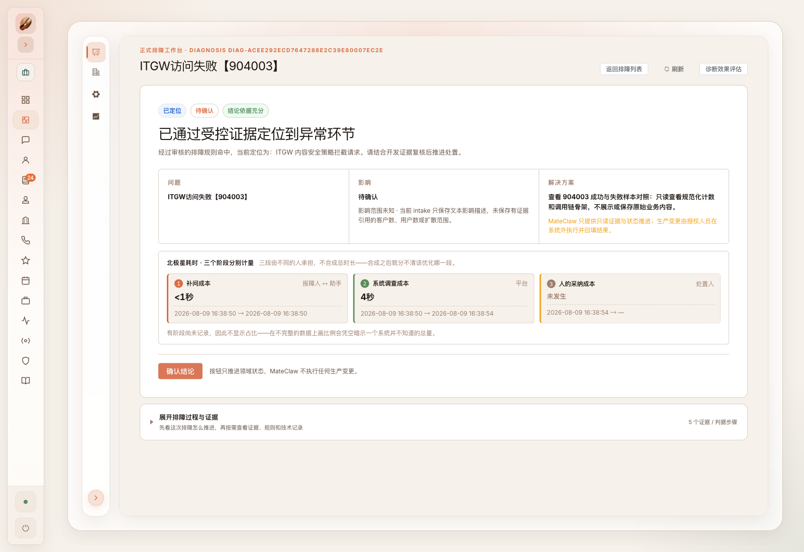
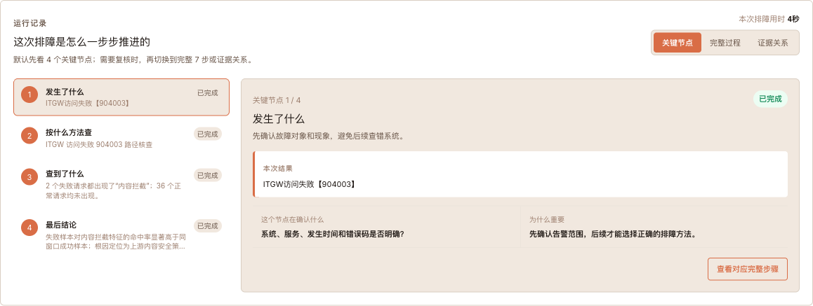
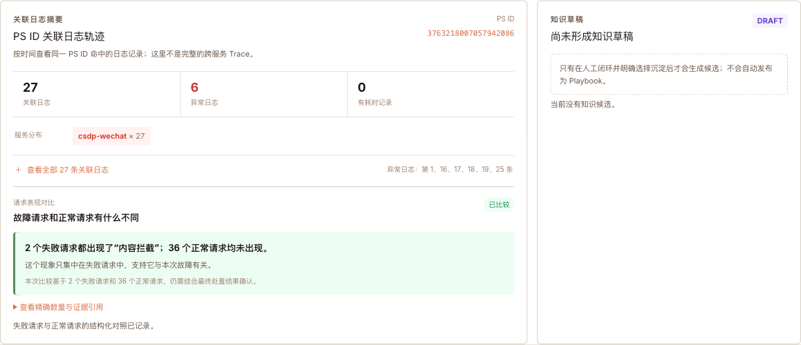

# MateClaw 智能排障

## 作品一句话介绍

MateClaw 智能排障让二线能够基于平台开展标准化排障，让三线开发快速进入陌生系统的有效调查，并在重大故障中帮助开发团队基于同一份证据快速收敛问题范围。

## 一、场景描述

### 1. 项目要解决的三个真实问题

#### 问题一：二线收到告警后，缺少可执行的排障方法

二线通常能看到告警现象，却不知道应该查哪些数据、怎样把证据串起来、什么情况下可以停止判断。因此，很多原本可以标准化调查的问题仍要升级给三线代查。

**平台要带来的结果**：二线从一条告警创建排障单，系统按照已经审核的方法自动读取证据、解释结果；证据充分时给出可复核结论，证据不足时明确指出缺口和升级原因。二线能够开始并推进排障，而不是只负责转发告警。

#### 问题二：三线开发接手陌生系统时，上手成本高

三线开发并不一定熟悉每个系统的日志字段、关联 ID、观测平台查询方式和历史故障经验。排障效果过度依赖少数熟手，换人、跨模块或夜间值班时尤其明显。

**平台要带来的结果**：把系统负责人已经验证的查询顺序、证据字段和判断条件固化为可审核的排障方法，让开发先看到结论，再反查过程和证据。这里所说的“降低开发要求”，是降低对目标系统内部细节、观测字段和少数专家记忆的前置依赖，不降低代码质量、生产权限和最终责任要求。

#### 问题三：重大故障发生时，团队很难快速收敛问题范围

重大故障中，最昂贵的往往不是打开日志页面，而是多人重复查询、信息口径不一致、看到异常后无法判断它是否与本次失败真正相关，导致跨团队沟通和无效排查不断增加。

**平台要带来的结果**：把失败请求与同一时间窗口的正常请求进行对照，保存查询顺序、判断条件和证据引用，让开发团队快速回答“异常集中在哪里、哪些方向已被排除、下一步由谁处理”。平台只帮助收敛和定位，不代替负责人执行生产变更。

| 使用者 | 过去的主要困难 | 平台首先要交付的能力 |
| --- | --- | --- |
| 二线 | 知道现象，不知道如何系统调查 | 按已审核方法开始并推进只读取证，形成初步定位或明确升级原因 |
| 三线开发 | 陌生系统上手慢，依赖少数熟手 | 快速理解调查路径、证据和结论，减少无效试错 |
| 重大故障协同团队 | 信息分散、判断口径不一、收敛慢 | 在同一排障单中统一证据、判据、结论和责任边界 |

### 2. 三个问题与三种处理方式不能混为一谈

三个问题描述的是项目希望给人带来的结果；会议讨论的三种模式，是平台实现这些结果的工作方式：

| 平台处理方式 | 适用情况 | 怎样帮助排障 | 当前状态 |
| --- | --- | --- | --- |
| 直接执行已审核方法 | 已有成熟排障方法，错误码或场景能够准确匹配 | 二线和新接手开发按固定路径取得证据，不必从零摸索 | ITGW 904003 已完成一条真实 Guance 竖线 |
| 解决后沉淀新方法 | 这次问题已经由人工或系统完成调查 | 把有效查询、证据与判断条件变成候选方法，回放和审核后供下次使用 | 候选、回放和审核机制已具备；组织复用效果待统计 |
| 没有方法时受限探索 | 没有可匹配的已审核方法 | 在已接入的只读工具范围内提出调查建议，证据不足时停止并转人工 | 受限辅助边界已具备；通用自主规划尚未达到投产证明 |

三种方式共同服务二线、三线和重大故障团队，并不是“一种方式只解决一个问题”。作品当前重点证明第一种方式可以在真源运行，同时诚实展示第二、第三种方式的治理边界。

### 3. 三个问题怎样证明真的解决

| 要解决的问题 | 正式试用要记录什么 | 什么证据才算解决 |
| --- | --- | --- |
| 二线可以开展排障 | 二线独立完成率、升级三线比例、从告警到首个可读结论的时间 | 二线不依赖三线代查就能完成标准场景，或能准确说明证据缺口和升级原因 |
| 三线快速上手 | 首次接手该系统的排障时间、人工求助次数、关键证据完整率 | 不熟悉系统的开发能按平台路径取得正确证据并作出可复核判断 |
| 重大故障快速定位 | 从告警到问题范围收敛的时间、重复查询次数、无效转派次数 | 多角色围绕同一排障单形成一致的证据范围、候选定位和责任边界 |

当前 ITGW 904003 案例证明的是“平台方法可以真实运行”，还不能单独证明上述三项组织效果已经实现。正式效能结论必须记录传统人工基线，并让二线和首次接手系统的开发用同类真实案例进行前后对照。

### 4. 排障过程中的共性断点

线上事件发生后，开发和运维通常要在告警群、监控平台、日志检索、调用关联信息和历史经验之间来回切换。上述三个真实问题，最终都表现为四个共性断点：

1. **入口信息不完整**：告警有系统、服务和现象，但缺少稳定的调查路径。
2. **证据分散**：失败日志、同一请求的关联日志以及正常请求分布在不同查询中。
3. **判断不可复核**：只看到某条异常日志，难以证明它只集中在失败请求中。
4. **经验难沉淀**：一次排障结束后，查询条件、判断标准和停止原因没有形成可复用资产。

### 5. 本次真实案例

作品选择 `CSDP / csdp-wechat / ITGW访问失败【904003】` 作为首条真实竖线：

- 告警时间：2026-08-07 17:12（Asia/Shanghai）
- 集群线索：`sz3-s-k8s`（只作为资产元数据，不猜测观测云字段映射）
- 服务：`csdp-wechat`
- 异常：ITGW 访问失败，错误码 `904003`
- 真实排障单：`diag-acee292ecd7647288e2c39e80007ec2e`

系统在真实 Guance 数据源上执行三次只读查询：先检索失败请求并取得真实关联 ID，再读取同一 ID 的关联日志，最后比较同一窗口的失败请求与正常请求。结果显示：**2 个失败请求都出现“内容拦截”，36 个正常请求均未出现**。经过审核的确定性规则据此定位到 ITGW 内容安全策略拦截环节，但仍要求开发结合处置结果确认。

### 6. 谁负责接入，开发怎么开始

接入不是让每个开发都配置一遍观测云，而是分成一次性准备与日常排障两条路径：

| 角色 | 在哪里操作 | 要完成什么 |
| --- | --- | --- |
| 平台管理员 | 取证接入 → 数据源联调 | 配置并验证 Guance 连接、认证、超时和只读边界；同一数据源只需统一配置 |
| 系统负责人 | 取证接入 → 系统与模块、查询规则 | 登记系统、服务、环境，维护失败检索、关联日志和正常样本对照规则 |
| 审核负责人 | 排障规则库、路由与绑定 | 把错误码或场景绑定到审核规则，完成只读试跑、回放和版本启用 |
| 开发或值班人员 | 智能排障 → 排障工作台 | 从告警创建排障单，查看结论与证据，确认、驳回或转人工 |

日常使用步骤：

1. 收到告警后进入“智能排障 → 排障工作台”，点击创建排障单。
2. 填写系统、服务、告警时间、错误码和故障现象；精确时间决定查询窗口。
3. 系统自动选择已审核的排障方法并执行只读取证，开发不需要自己编写 DQL。
4. 在详情页先看“发生了什么、最后结论”，需要复核时再查看关键节点、完整七步和证据关系。
5. 负责人确认或驳回结论，在平台外完成生产处置并登记结果；结案后可形成候选排障方法。

如果系统尚未接入、规则未审核或真实证据不可用，平台会明确显示配置缺口或“证据不足”，并转回人工排障，不会用 Demo、历史猜测或模型回答替代真实证据。

## 二、方案设计

### 1. 主流程

```text
告警进入
  → 识别系统、服务、时间与错误码
  → 选择已审核的排障方法
  → 明确三份只读证据
  → 选择观测云适配器并执行查询
  → 规范化、脱敏和确定性压缩
  → 计算判断条件
  → 输出已定位 / 证据不足 / 转人工
```

### 2. 三次只读取证

| 次序 | 查询目的 | 运行时输入 | 安全输出 |
| --- | --- | --- | --- |
| 1 | 找到故障窗口中的失败请求 | 系统、服务、错误码、绝对时间窗 | 失败数量、受限关联 ID |
| 2 | 查看同一请求发生过什么 | 第一步返回的真实关联 ID | 时间、服务、级别、白名单异常标记 |
| 3 | 比较故障请求与正常请求 | 同一服务、同一窗口、审核特征 | 两组请求数、出现异常特征的请求数 |

整个过程不返回或持久化 API Key、DQL、原始日志正文和业务内容。查询失败、证据缺失或规则无法计算时，系统按 fail-closed 原则输出“证据不足”，不会猜测根因。

### 3. 两种视图

- **业务结果视图**：回答发生了什么、影响是否明确、当前结论和下一步由谁处理。
- **开发证据视图**：展示四个关键节点、完整七步、关联日志摘要、请求表现对比、判断条件和证据引用。

两个视图读取同一份 Diagnosis，不维护两套事实。

### 4. 安全与治理

- 命中已审核错误码规则时全程零模型调用。
- 只注册只读证据能力，不提供生产写执行器。
- 人工“确认结论”只推进排障单状态，不执行生产变更。
- 查询规则、排障方法和版本均需审核；Diagnosis 冻结精确版本，历史结论可重放。
- 缺少规则、数据连接或证据时直接弃权，不回退到 Demo 或推测数据。

## 三、AI 工具使用说明

### 1. 产品运行时的 AI

MateClaw 把 AI 放在“适合提出建议、但不应成为权威”的位置：

- **未知场景调查建议**：未命中审核规则时，受限 Agent 只能在硬白名单内提出只读调查建议；模型或数据源不可用时直接停止。
- **历史经验归纳**：AI 根据规范化证据生成排障方法草稿，经过确定性校验、固定样本回放和人工审核后，才可成为可用规则。
- **证据解释**：将技术字段和计数翻译成开发可理解的说明，但不改变底层证据和确定性结果。

错误码已命中的在线主路径不调用大模型，避免模型概率、提示词变化或供应商状态影响生产判断。

### 2. 研发阶段使用的 AI 工具

- **Codex**：用于代码库理解、跨前后端实现、测试补齐、浏览器验收、文档和提交材料生成。
- **Claude**：用于早期架构讨论、方案反证和交互方案迭代。
- **人工把关**：场景边界、真实查询字段、判断阈值、审核启用和生产处置均由人负责。

AI 生成的代码和方案通过单元测试、确定性回放、真实只读调用与页面验收反向验证，不能以“模型说可以”作为完成标准。

## 四、效能提升说明

### 1. 工作方式变化

| 排障环节 | 传统方式 | MateClaw |
| --- | --- | --- |
| 信息整理 | 人工从告警中提取系统、服务、时间和错误码 | 创建排障单时结构化保存 |
| 查询路径 | 依赖个人经验，容易查错窗口或字段 | 使用审核过的排障方法和绝对时间窗 |
| 证据串联 | 手工复制关联 ID 并反复切换页面 | 第一次查询结果自动成为后续查询唯一输入 |
| 异常判断 | 看见错误日志后凭经验推断 | 失败请求与正常请求同窗对照，再计算确定性条件 |
| 过程复核 | 聊天记录和截图分散 | 四关键节点、七阶段、证据关系在同一排障单 |
| 经验复用 | 依赖口口相传 | 结案后形成候选，回放和审核后再启用 |

### 2. 当前真实记录

- 1 条真实 Guance 错误码竖线已经贯通。
- 3 次 Guance-only 只读查询均取得规范化证据。
- 本次系统调查阶段记录约 4 秒。
- 2 个失败请求均出现异常特征；36 个正常请求均未出现。
- 2 条确定性判断条件成立，最终输出“已定位、待人工确认”。
- 当前固定检查点的排障域与 Skill Manifest 回归为 864/864。

这些数字证明当前案例可复核，不代表所有系统的平均效率。正式效能结论需要在 20–30 条历史样本上统计人工补问、系统调查和人工采纳三个阶段的 p50/p95。

同时还要开展面向人的试用对照：二线是否减少升级、首次接手系统的开发是否减少求助、重大故障是否更快收敛。一次机器调查约 4 秒，不能替代这三项业务效果的验证。

## 五、Demo 与效果说明

### 1. 结果总览

结果页先给出“已定位、待确认”，并分别展示补问成本、系统调查成本和人工采纳成本。平台明确提示：确认按钮只推进状态，不执行生产变更。



### 2. 四个关键节点

默认用大白话展示“发生了什么、按什么方法查、查到了什么、最后结论”；需要技术复核时可切换完整七步和证据关系。



### 3. 证据对照

页面把计数翻译成完整语句，并明确 PS ID 区域只是关联日志，不冒充完整 Trace。



## 六、创新点

1. **成功样本对照**：不仅查到失败日志，还验证异常特征是否集中在失败请求中。
2. **证据优先于模型**：真实查询、规范化证据和确定性规则构成权威链，AI 只做建议和解释。
3. **同一证据双投影**：业务负责人看结论和责任边界，开发看查询、判据和证据引用。
4. **可弃权设计**：没有证据就停止，比生成一个听起来合理的答案更安全。
5. **经验生产闭环**：真实结案可以生成候选规则，但必须经回放和人工审核后才能影响下一次排障。

## 七、当前完成度与投产计划

### 已完成

- MateClaw 内部确定性排障领域模块、正式工作台和排障单生命周期。
- Guance 只读适配器、三次取证、脱敏压缩和失败/正常请求对照。
- `CSDP / csdp-wechat / 904003` 真实案例端到端跑通。
- 查询规则目录、系统与模块接入、排障方法审核、历史回放和案例沉淀入口。

### 投产前必须完成

1. 由各系统 owner 核对 measurement、字段、时间单位、索引和查询窗口。
2. 从准备队列补齐查询规则，冻结至少 20 个真实可执行目标；当前正式目标目录仍为 0/20。
3. 对当前配置指纹完成 owner acceptance，再运行 20–30 条历史影子样本。
4. 统计三段北极星耗时和误判/弃权情况，形成 p50/p95 与准入阈值。
5. 完成 RBAC、审计、告警通道、回滚演练和生产运行手册。

## 八、作品价值

MateClaw 不是把大模型接到日志搜索框，而是把排障变成一条受控的证据链：让二线有方法开始并推进排障，让三线开发进入陌生系统后更快取得有效证据，让重大故障团队围绕同一份事实快速收敛。一次真实排障还可以沉淀为下一次可审核、可重复执行的组织能力。
