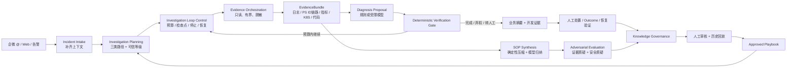

# IT 智能排障系统 · 架构 v4（MateClaw-only）

> 状态：**现行设计，架构师评审通过（P1 实施门）· 当前修订 v4.6 / 蓝图 v0.20**
>
> 产品事实来源：`docs/intelligent-troubleshooting/recording-product-baseline.md`
>
> 评审记录：`docs/intelligent-troubleshooting/architecture-review-v4.md`
>
> 第一性原理评价与修订决议：`docs/intelligent-troubleshooting/architecture-critique-v4.md`
>
> **2026-07-28 v4.1 修订（用户已认可）**，五处改动：
> 1. §5.7 晋升资格分**校准期 / 运行期**两档（**D5′**）——原表要求每条证据型草稿都先有人工参考解法，
>    等于把学习环吞吐封顶在人工产量上，与"知识生产是一等闭环"自相矛盾；
> 2. 新增 §5.10 **北极星时间戳契约**——原设计的北极星是人的时间，而预算表量的是机器时间，缺度量装置；
> 3. §6 增加第 2.5 步**成功样本对照（negative control）**，§9.1 预算相应由 2 次取证改为 3 次；
> 4. §4.2 / §5.8 / §5.9 标记 `PENDING-EVIDENCE`——未被真实失败检验过的设计分支也应标 fixtureMode；
> 5. §9 声明为**红线的唯一权威清单**，其余文档只引用不复述。
>
> **2026-07-28 v4.2 修订（源码复核后补）**：本设计此前把企微当成需要新建的入站通道，
> 但 MateClaw **已经自带完整企微通道**（`vip.mate.channel.wecom`）。修正见新增 §7.4 与 **D17**：
> 通道一律复用现有 `ChannelAdapter`：普通消息走 `ChannelMessageRouter` pre-route，
> 模板卡片事件才走 `CardKind`，**不新建第二条入站路径**。
> 同时记录一个真实约束：`WeComCardRenderer` / `FeishuCardRenderer` 的签名都是
> `render(ApprovalNotice)`——tool-guard 的形状，渲染不了诊断，出站需要先泛化该接缝。
>
> **2026-07-29 v4.3 修订（入站源码与实现复核）**：`CardKind` 只处理模板卡片事件，
> 企微普通 @ 消息改为复用 `ChannelMessageRouter` 的显式 pre-route handler。补齐独立
> `IntakeSession`、幂等/乱序/并发边界、`reportedAt/readyAt` 与附件安全引用。企微
> `reporterRef` 在 Intake 阶段只是不可信通道身份：允许报障/补充，但未映射 workspace
> 主体时不得审核、确认或推进受审计状态。
>
> **2026-07-29 v0.15 实现状态校准（不升架构版本）**：`READY` 现已在同一事务写入
> 数据库租约任务，后台复用既有只读 `TroubleshootingIntakeService` 产出 Diagnosis；
> `source_intake_session_id` 保证一份 Intake 只归属一个 Diagnosis。完成后从同一份
> `BusinessSummary` 生成纯文本并经 workspace-aware local leader 与 `proactiveSend` 原路返回，
> 平台 ACK 后才完成，附正式 `/troubleshooting?diagnosisId=...` 深链；卡片和关闭后通知仍未实现。
>
> **2026-07-29 v0.16 实现状态校准（不升架构版本）**：Intake 来源 Diagnosis 进入 `CLOSED`
> 且已登记 `ClosureRecord` 时，同一事务边界将 V180 通知状态设为 `PENDING`。120 秒租约
> worker 只在本节点持有精确 workspace 路由时认领，把 `BusinessSummary + ClosureRecord`
> 组合为纯文本最终结果，通过 `DeliveryOptions` 安全 @ 原报障人，并在平台 ACK 后才完成。
> 失败持久化退避、无硬重试上限；非 Intake 来源的 Web/API Diagnosis 为 `NOT_APPLICABLE`。
> 群聊只有在当前 Adapter 持有入站 reply context 时才算可投递；重启后任务保持未认领，等待新入站
> 恢复 `req_id`，不回落平台禁止的 `aibot_send_msg`。结案摘要入库前限制 500 字并拒绝凭据、DQL、
> 原始日志与伪造 mention；出站正文再做脱敏、mention 转义与 1800 字硬预算。正式工作台同步展示
> 类型化最终处置结果；出站交互卡片仍未实现。
>
> **2026-07-30 v4.4 修订（部署拓扑拨测归位）**：纠正“独立拓扑分析弹窗 +
> 临时结果”的实现漂移。部署拓扑快照是 Workspace 不可变资产，
> `deployment_topology_probe` 是 `SCENARIO_PLAYBOOK`，`topology_synthetic_probe` 是域内只读语义 Tool，
> Guance CloudDial 是来源 Adapter。选定资产、执行记录与安全结果必须归属同一 Diagnosis，
> 作为 EvidenceBundle 的可追溯证据投影进入排障详情，不另造诊断主流。见 §3.4、§5.11 与 **D18**。
>
> **2026-08-01 v4.5 修订（错误码录制证据规模化）**：关闭 T0.8 的机制决策。
> 每条错误码 Playbook 只维护一份服务端持有、脱敏且有边界的历史聚合正例；服务端按封闭判据词汇
> 确定性生成排除例和缺证据弃权例，仍执行原有正/负回放晋升门，绝不降门槛。固定套件继续
> fail-fast，坏的生成种子只隔离本条，不拖垮应用启动。历史回放始终是 fixture，真实可信度仍由
> T7 在线验收决定。见 §5.7 与 **D19**。
>
> **2026-08-14 v4.6 修订（资产授权补上场景维度）**：由 `csdp-wechat`「URL 慢请求」真实告警暴露。
> 现行 Guance 资产授权键是 `(workspaceId, system, service, signalKind)` → 唯一合同，**场景不参与解析**，
> 因此一个服务只能承载一个场景：`csdp-wechat` 的 `log_search` / `log_trace_bundle` / `contrast_sample`
> 已被 ITGW 904003 占满，慢请求场景无处落地，而 `log_trace_bundle` 恰是该次人工排障定位根因的关键一步。
> 这与 §4.1「一个 Tool 可以路由到多个来源 Adapter，绑定关系由服务端配置和 approved EvidencePlan 决定」
> 的设计意图不一致——实现上 EvidencePlan 其实无从选择合同。修正见新增 §5.13 与 **D20**：
> 授权键增加服务端拥有的 `scenarioKey` 维度，场景来自已冻结 Playbook 而非请求参数，
> 旧配置必须显式声明所属场景，不设通配、默认场景或隐式回退。
> 排障证据见 `docs/intelligent-troubleshooting/incident-csdp-wechat-slow-request-2026-08-06.md`。
>
> 2026-07-28 v0.8 增量：把 Loop Engineering 建模为有界调查内循环与知识改进外循环；
> 多 Agent 只用于结构化反证和影子评测，不进入默认在线主链，也不取得裁决权。
>
> 替代：`intelligent-troubleshooting-architecture-v3.md`。v3 的单 MateClaw 运行时、确定性命中路、
> 只读取证、人工审核和禁止生产写仍有效；v4 修正其把“日志→SOP”降为辅助能力、只按错误码组织主轴、
> 以及把 Web 当作主要入口的产品偏差。

## 0. 结论先行

系统的中心不是错误码查表，也不是让 Agent 自由排障，而是一条**证据脊柱**：

```text
报障上下文 → 只读证据计划 → 观测证据 → 可引用诊断
                                      ├→ 给服务经理 / 开发的双投影
                                      └→ 可审核的 PlaybookDraft / KnowledgeCandidate
```

同一条证据脊柱同时服务两个闭环：

1. **在线排障闭环**：尽快给出可核验的定位、影响面和下一步；
2. **知识生产闭环**：把证据与人工解法沉淀为经审核、可回放的 Playbook。

这两个业务闭环进一步按 Loop Engineering 落成两层受控循环：

- **调查内循环**：计划 → 取证 → 提议 → 校验 → 继续 / 完成 / 弃权 / 转人工；
- **知识改进外循环**：草稿 → 结构化反证 → 回放 → 人工裁决 → 版本化知识 → outcome 反馈。

循环由服务端预算、检查点和确定性 Gate 驱动，不由模型自行宣布“完成”。多 Agent 的一致意见也不是证据，
不能代替引用校验、历史回放或人工审核。

错误码型、场景型和开放探索型是三种不同调查路径，必须显式标注可信等级。模型可以提出场景、归纳草稿和
解释证据，但不能把自己的选择伪装成确定性命中，不能批准知识，也不能执行生产写。

## 1. 第一性原理

### 1.1 用户真正购买的结果

用户不是要一个“智能排障平台”，而是要减少以下时间：

- 服务经理反复追问客户 ID、截图、时间点；
- 开发在日志、链路、K8S、代码之间来回切换；
- 每次从零还原调用链和排查步骤；
- 同类故障解决后没有成为下次可复用的方法。

因此系统的北极星结果是：

> **从一条不完整报障，到一个带证据、可交接、可复用的定位结论所需的时间。**

### 1.2 不可妥协约束

| 编号 | 约束 | 直接工程含义 |
|---|---|---|
| A1 | 证据先于推理 | 结论只能引用本次服务端实际取得且非 `MISSING` 的 EvidenceResult |
| A2 | 一份事实，两种投影 | 业务摘要和开发证据来自同一个 Diagnosis |
| A3 | 草稿不是权威 | AI 生成 `PlaybookDraft`；只有审核和回放通过的 Playbook 才能稳定路由 |
| A4 | 可信等级不混淆 | 明确字段、规则或模型提议的路由必须可见，前端不能统一显示成“已命中” |
| A5 | 自动化止于只读 | 生产写工具不注册；人工批准只推进状态，不触发执行 |
| A6 | 不完整比编造更好 | 缺证据、引用失效、低置信时必须 abstain 或转人工 |
| A7 | 原始日志不进模型 | 先限量、脱敏和确定性压缩，再给模型结构化骨架 |
| A8 | MateClaw 是唯一运行底座 | 同一 Java 服务、身份、工作区、通道、模型配置和审计 |
| A9 | 一种能力只有一个实现 | 在线诊断和 SOP 合成都复用同一 Evidence Orchestration |
| A10 | 真实验证决定放权 | recorded replay 只证明工程链路，不能冒充真实观测云已验证 |
| A11 | 循环状态显式且有界 | 每次迭代、预算消耗、检查点和停止原因可审计；到限必须 abstain / 转人工 |
| A12 | 反证不是裁决 | 多 Agent 只提交结构化质疑；共识、票数和修辞不能成为权威依据 |
| A13 | 未验证的设计也要标 fixture | A10 同样适用于架构自身：没有被真实失败检验过的设计分支不得据以新增实现、接口或表结构 |

> 本表是**推导来源**。红线的**唯一权威清单在 §9**；HANDOFF、TODO、蓝图和评审只引用 §9，不复述条目。
> 出现分歧时以 §9 为准。

### 1.3 当前明确不做

- 不自动重启、扩容、切流、改配置、改数据或改代码；
- 不让模型猜出错误码后进入错误码确定性命中路；
- 不把 Wiki、Memory、Skill 或聊天记录当作诊断权威；
- 不再引入第二套排障平台、独立 Python orchestrator 或额外 Agent runtime；
- 不让多个 Agent 自由辩论后以多数票决定根因、可信等级或知识晋升；
- 不允许 Agent 递归创建 Agent、扩大工具范围或自行延长预算；
- 不把复杂大屏和炫技交互当作 MVP 成功证据。

## 2. 一个证据脊柱，两个闭环



两个闭环共享 Incident、EvidenceBundle 和 Provenance，但状态机相互独立：

- 故障可以尚未关闭就产生证据型 `PlaybookDraft`；
- 没有人工解法或真实 outcome 的草稿不能直接晋升为权威 Playbook；
- 关闭故障不等于自动批准知识；知识审核失败不回滚已完成的故障处置。

`ERROR_CODE_PLAYBOOK` 仍是固定的一轮确定性执行，Loop Control 不引入模型；`SCENARIO_PLAYBOOK` 与
`OPEN_DISCOVERY` 才可能在预算内继续取证。对抗评测首阶段只在 P2 历史样本和知识候选上影子运行，不阻塞
在线结果，也不改变现有 P1 一次模型归纳的实施边界。

### 2.1 配套可编辑图件

- [总体架构图（Draw.io）](../docs/intelligent-troubleshooting/diagrams/mateclaw-troubleshooting-architecture.drawio) · [SVG 预览](../docs/intelligent-troubleshooting/diagrams/mateclaw-troubleshooting-architecture.svg)
- [端到端流程图（Draw.io）](../docs/intelligent-troubleshooting/diagrams/mateclaw-troubleshooting-flow.drawio) · [SVG 预览](../docs/intelligent-troubleshooting/diagrams/mateclaw-troubleshooting-flow.svg)
- [跨角色泳道图（Draw.io）](../docs/intelligent-troubleshooting/diagrams/mateclaw-troubleshooting-swimlane.drawio) · [SVG 预览](../docs/intelligent-troubleshooting/diagrams/mateclaw-troubleshooting-swimlane.svg)

三张图共享本 RFC 的同一语义：一条证据脊柱、两个独立闭环、两层受控 Loop、三类调查路径、结构化反证
不等于裁决、candidate 不等于 approved，以及生产写始终留在系统边界之外。

## 3. 三类调查路径

### 3.1 路径与权威分开建模

```text
investigationMode = ERROR_CODE_PLAYBOOK | SCENARIO_PLAYBOOK | OPEN_DISCOVERY
routeAuthority    = EXPLICIT | RULE_MATCHED | MODEL_PROPOSED
```

`investigationMode` 表示怎么调查；`routeAuthority` 表示为什么选中。两个维度不能继续压成 v3 的单个
`DETERMINISTIC / LLM_FALLBACK` 字段。

| 调查路径 | 典型入口 | 模型角色 | 可信上限 | 可产生动作 |
|---|---|---|---|---|
| `ERROR_CODE_PLAYBOOK` | 明确 `(system,error_code)` 命中 approved Playbook | 命中路零 LLM；可选做非权威摘要 | 由确定性判据决定，可到 HIGH | 只读动作 + 人工动作 |
| `SCENARIO_PLAYBOOK` | 慢接口、系统不可用、会话发送失败等 | 可提议 `scenarioKey`，不能伪装成确定性命中 | 模型提议时最高 MEDIUM | 只读调查计划；恢复动作仍人工 |
| `OPEN_DISCOVERY` | 未知现象、无可用 Playbook | 受限 Agent 组合唯一证据工具并解释 | 最高 MEDIUM；证据不足 abstain | 不产生恢复动作 |

### 3.2 场景 Playbook 不破坏错误码安全边界

场景 Playbook 可以正式存在，但它不获得错误码命中路的权威：

1. 企微/Web 明确选择了已注册 `scenarioKey` 时，按固定只读 EvidencePlan 执行；
2. 模型从自由文本推荐场景时，记录 `MODEL_PROPOSED`，结论最高 MEDIUM；
3. 场景执行仍必须以服务端证据和类型化判据为依据；
4. 模型推测的 errorCode 只能作为搜索关键词，不能回流到 `ERROR_CODE_PLAYBOOK`；
5. 真实样本证明某场景选择规则唯一、可审核、可回归后，才可另行提升 routeAuthority。

### 3.3 模型只提议注册键，不生成调查程序

模型参与场景选路时，输出只能是：

```text
ScenarioProposal = scenarioKey + parameterCandidates + reason + confidence
```

服务端随后执行四道硬校验：

1. `scenarioKey` 必须来自当前 workspace 可见的 approved Scenario Playbook 注册表；
2. 参数名必须在该 Playbook 的 `ParameterBindingSpec` 白名单中；
3. 参数值必须来自 Intake 已确认字段或本次 EvidenceBundle，不接受模型凭空补值；
4. 真正执行的 EvidencePlan、超时、行数上限和平台绑定全部来自 approved Playbook，模型不能返回 DQL、
   `EvidenceRequest` 或工具名。

任一校验失败都进入 `OPEN_DISCOVERY` 或 abstain。这样模型只负责“建议用哪张已审核地图”，没有权力画地图。

### 3.4 部署拓扑拨测的三层归位（v4.4 新增）

部署拓扑拨测不是一个平行的“诊断产品”，而是现有排障域中第一个经真实数据验证的具体场景与 Tool 合同：

| 层次 | 稳定身份 | 责任 | 不能变成 |
|---|---|---|---|
| Workspace 资产 | `DeploymentTopologySnapshot` | 保存已校验、不可变、可重用的部署图与拨测任务引用 | Tool 或一次运行结果 |
| 场景 Playbook | `deployment_topology_probe` | 定义何时选择拓扑、执行哪个语义 Tool、验证和如何归并证据 | 一个脱离 Diagnosis 的快捷弹窗 |
| 只读 Tool | `topology_synthetic_probe` | 批量执行有界合成拨测，输出 canonical 节点观测和疑似链路 | Guance 特定 DQL 或任意 URL 执行器 |
| 来源 Adapter | `Guance CloudDial` | 负责认证、绑定、超时、查询与 canonical 转换 | 用户可控的查询主机或调查路由器 |

执行前必须已存在 Diagnosis；全局入口若保留，也必须先创建或明确绑定 Diagnosis 再运行。
结果中的失败节点和相邻链路只是证据与核查提示，不得直接声称根因；未覆盖节点也不得被投影为健康。

## 4. 深模块与接口

v4 不增加微服务。所有模块都在 `vip.mate.troubleshooting` 内，通过小接口隐藏复杂实现。下表是**目标边界**，
不是要求 P1 一次性新增八个 service；实施必须沿现有代码做扩展替换。

| 深模块 | 对调用方的接口 | 隐藏的实现复杂度 | 当前落点 / 变化 |
|---|---|---|---|
| Incident Intake | `IntakeDecision accept(IntakeEnvelope)` | 通道身份、幂等、脱敏、完整性检查、补问 | 深化现有 Controller/Intake；新增 `AWAITING_INPUT` 语义 |
| Investigation Planning | `InvestigationPlan plan(IncidentContext)` | Playbook 查找、三类路径、routeAuthority、预算和证据计划 | 从现有 Intake 中抽出；不暴露各匹配器 |
| Investigation Loop Control | `LoopOutcome run(LoopInput, LoopPolicy)` | 迭代、检查点、预算、验证反馈、恢复、停止和弃权 | 深化现有 Agent Graph / DiscoveryPolicy；P1 不新建，P4 按真实样本引入 |
| Evidence Orchestration | `EvidenceBundle collect(IncidentContext, EvidencePlan, CollectionPolicy)` | 域内 Tool Registry、语义 Tool 插件、来源 Adapter、限量、超时、脱敏、canonical 校验、引用和降级 | 深化现有 `EvidenceSourceRouter`；Agent 仍只暴露一个只读门面，在线与合成共用 |
| Diagnosis Engine | `Diagnosis diagnose(DiagnosisInput)` | 确定性判据、受限模型、置信校准、abstain、双投影原始事实 | 统一现有确定性与 miss-path 结果契约 |
| SOP Synthesis | `PlaybookDraft draft(SynthesisInput)` | PS ID 贯通、压缩、模型结构化输出、引用验证、非写动作校验 | 深化现有 `SopSynthesisService.preview()`；兼容 API 暂保留 SOP 命名 |
| Case Lifecycle | `CaseSnapshot handle(CaseCommand)` | 确认、转派、批准不执行、结果登记、恢复验证、关闭 | 保留现有状态机和审计语义 |
| Knowledge Governance | `KnowledgeRecord decide(KnowledgeCommand)` | draft/candidate/approved/deprecated、审核理由、回放、版本替换 | 深化现有 candidate + SOP registry，独立于 Outbox 发布状态 |
| Adversarial Evaluation | `AdversarialEvalReport evaluate(EvalSubject)` | Evidence Challenger、Safety Challenger、角色隔离、反证合并、成本和轮次控制 | P2 先做离线/影子 Adapter；证明质量收益后才可成为知识晋升输入 |
| Experience Projection | `BusinessSummary business(Diagnosis)` / `DeveloperEvidenceView developer(Diagnosis)` | 业务摘要、开发证据和能力边界措辞 | 领域只产出类型化事实；企微/Web 各自在 Adapter/View 层排版，禁止领域输出 HTML/卡片结构 |

P1 的最小实现只允许深化三个既有落点：

1. `SopSynthesisService` 继续做取证流水线编排；
2. 新增一个结构化归纳 seam 和一个确定性校验 seam，优先复用 MateClaw 已有 Spring AI 1.1.8
   `BeanOutputConverter` 与模型配置工厂；
3. 复用 `EvidenceSourceRouter`、`DeterministicLogTraceCompressor`、`TroubleshootingSecretRedactor`，
   暂不创建 Planning、Projection、WeCom 或新状态机实现。

### 4.1 只读证据 Tool 插拔点

外部暴露面保持一个，内部扩展点拆成两层，避免把“工具能力”和“数据来源”混成一个接口：

```text
Investigation Plan / OPEN_DISCOVERY
                │
TroubleshootingEvidenceTool                 // 唯一 Agent 可见只读门面，现有
                │
ReadOnlyEvidenceToolRegistry                // 域内注册表，目标扩展点
                │
ReadOnlyEvidenceTool SPI                    // log_search / trace / topology_synthetic_probe / ...
                │
EvidenceSourceRouter                        // 现有主备路由、调用级平台白名单
                │
EvidenceSourceAdapter SPI                   // Guance / Recorded Replay / K8S / Git
                │
canonical EvidenceResult
```

两层 SPI 的职责不同：

- `ReadOnlyEvidenceTool` 表达“取得哪一种语义证据”，拥有稳定 `toolKey`、版本、输入/输出 schema、默认预算和所需 capability；
- `EvidenceSourceAdapter` 表达“从哪一个平台取得证据”，负责认证、平台查询绑定、超时、降级和 canonical 转换；
- 一个 Tool 可以路由到多个来源 Adapter，同一个 Adapter 也可以支持多个 Tool，绑定关系由服务端配置和 approved EvidencePlan 决定；
- 第一阶段按 Spring Bean 列表插拔；只有真实来源和 Tool 合同稳定后，才考虑通过 MateClaw Plugin JAR 动态装卸。

插件注册必须满足以下硬门：

1. `toolKey + version` 唯一，重复注册启动失败；Descriptor、健康状态和启停原因可查询，但不暴露凭据或平台查询文本；
2. capability 固定为 `READ_EVIDENCE`，请求仍经过 workspace、会话、参数 schema、超时、行数、字符和脱敏预算；
3. 模型不能指定实现类、平台、DQL 或任意工具名；命中 Playbook 时由 EvidencePlan 决定，开放探索也只能选择 DiscoveryPolicy 允许的语义 `toolKey`；
4. Tool 输出必须转为本次 EvidenceBundle 内的 canonical `EvidenceResult`，引用失效或来源不可用时 fail closed；
5. 不直接复用通用 `vip.mate.tool.ToolRegistry` 暴露这些内部插件。该注册表管理 Agent 可见的 `@Tool`、MCP 和 Plugin Callback，边界过宽；排障域使用独立的 `ReadOnlyEvidenceToolRegistry`。

因此，“Tool 可插拔”不会改变“模型路径只看到一个只读证据工具”的安全红线。它增加的是服务端内部能力扩展性，
不是让模型获得一个开放工具箱。

### 4.2 Loop Engineering 与多 Agent 反证的位置

> **状态：`PENDING-EVIDENCE`（未生效设计，A13）。** 本节描述的是 P4/P5 的目标形态。
> 当前真实跑通的只有“两次取证 + 一次确定性压缩”，且全部在 fixture 上。在真实失败模式出现之前，
> 本节不得成为新增实现的依据；D12 / D13 同此状态。

Loop Engineering 不是第二个运行时，也不是把 `while` 循环散落在 Controller、prompt 和定时任务里。它在
排障域形成一个深模块：调用方只提交 `LoopInput + LoopPolicy`，实现内部完成“计划、取证、提议、校验、
恢复和停止”，最终只返回 `LoopOutcome`。删除这个模块时，预算、检查点和停止语义会重新散落到 Diagnosis、
Synthesis 和 Agent Graph 调用方，因此这个 seam 有实际深度。

模型角色只存在于该实现或 Adversarial Evaluation 实现内部，不扩大领域接口：

1. `Investigator / Inducer`：形成带证据引用的 Diagnosis Proposal 或 PlaybookDraft；
2. `Evidence Challenger`：逐条寻找反证、矛盾、引用缺口和未评估项；
3. `Safety Challenger`：检查生产写、DQL、越权工具、虚假高置信和能力边界；
4. `Deterministic Verification Gate`：根据 schema、引用、规则、回放和预算作出机器可复算决定；它不是 Agent；
5. Human Reviewer：知识晋升和生产处置的最终责任人。

两个 Challenger 首阶段只读取冻结的 `EvalSubject + EvidenceBundle`，不直接调用证据源。需要补证据时只返回
`EvidenceGap`，由 Loop Control 判断是否仍有预算，并经唯一 `TroubleshootingEvidenceTool` 门面取得。这样既能
产生真正的反证压力，又不会给“质疑角色”另开工具箱。

对抗协议是固定角色、固定 schema、固定一轮的结构化评测，不是自由聊天：

```text
Proposal + immutable EvidenceBundle
  ├─ Evidence Challenger → contradictions[] + missingEvidence[]
  └─ Safety Challenger   → unsafeActions[] + authorityViolations[]
                         ↓
               AdversarialEvalReport
                         ↓
        deterministic replay gate + human review
```

相同模型的多个副本、角色票数或表面共识都不能提升置信度。只有独立证据、可复算判据和历史样本指标能够改变
验证结果。P2 影子评测若不能在等预算基线下改善引用完整率、弃权质量或危险动作拦截率，就不进入在线路径。

### 4.3 深度检查

- 调用方只提交 Incident 或命令，不需要知道 Guance DQL、模型 prompt、重试或脱敏顺序；
- `EvidenceSourceAdapter` 是真实接缝：已有 Guance 与 Recorded Replay 两个 Adapter；
- 新增语义证据能力只增加 `ReadOnlyEvidenceTool`，观测源变化只改 Adapter 与绑定，不改 Playbook 和上层调用；
- Agent 侧继续只绑定 `TroubleshootingEvidenceTool`，内部 Tool 插拔不扩大 Agent 的工具可见面；
- 模型调用留在 Diagnosis/Synthesis 实现内部，不把 provider 细节暴露给领域接口；
- Loop Control 对调用方隐藏具体 Agent 数量、模型、轮次与恢复策略；调用方不能请求“再辩一轮”；
- Adversarial Evaluation 只有一个报告接口，Challenger 是内部 Adapter，不形成三套浅服务；
- 测试通过上述接口验证可观察结果，不跨接口断言内部步骤。

### 4.4 依赖方向

```text
WeCom / Web / Alert adapters
             │
       Incident Intake
             │
   Investigation Planning ─────► Playbook Repository
             │
   Investigation Loop Control
          │             ▲
          ▼             │ verification feedback
   Evidence Orchestration ─────► ReadOnlyEvidenceToolRegistry
                                      │
                                      ▼
                                ReadOnlyEvidenceTool
                                      │
                                      ▼
                                EvidenceSourceRouter
                                      │
                                      ▼
                                EvidenceSourceAdapter
          │          │
          │          └─────────► SOP Synthesis ─────► Adversarial Evaluation
          └────────────────────► Diagnosis Engine ──► Verification Gate
                                      │
                              Experience Projection
                                      │
                               Case Lifecycle
                                      │
                             Knowledge Governance
```

`EvidenceSourceRouter`、模型 Adapter、Challenger Adapter 和 Repository 都是实现内部的 seam；通道、数据库、
观测平台和具体模型不能反向依赖领域模型。Verification Gate 可以消费 Agent 报告，但不能依赖 Agent 的同意。

## 5. 稳定契约

本章同时记录**目标领域合同**和**当前运行时实现**；“稳定”表示字段语义与边界已经冻结，
不表示每个伪代码名称都已经存在同名 Java 类型。以下台账是本章的实现状态权威：

- `IMPLEMENTED`：运行时已有对应合同，且关键边界已落地；
- `PARTIAL`：已有行为或较窄合同，但名称、聚合边界或生命周期尚未收敛；
- `NOT_IMPLEMENTED`：仅为后续目标，当前代码不能依赖它；
- `PENDING-EVIDENCE`：按 D16 故意不实现，必须先由真实失败样本决定形状。

| 设计合同 | 状态 | 当前运行时事实 | 收敛决定 / 触发条件 |
|---|---|---|---|
| §5.1 `IntakeEnvelope / IntakeDecision` | `PARTIAL` | `IntakeMessageEnvelope`、`IntakeDecision`、`IntakeSession` 已承载入站、补问与事件时间；没有同名 `IntakeEnvelope` | RFC 记下真实命名，不为对齐伪代码迁移通道和持久化合同 |
| §5.2 `IncidentContext` | `IMPLEMENTED` | 同名领域类型已存在，`IncidentImpact` 与 completeness 边界已落地 | 保持 |
| §5.3 `InvestigationPlan` | `PARTIAL` | 固定证据脊柱使用 `EvidenceSpinePlan` 与 `ApprovedEvidenceSpineCatalog.ApprovedSpinePlan`；V197/V198 `OpenDiscoveryRunAudit` 冻结本次可见/已选场景键、精确计划指纹、三类计划信号与服务端预算；`InvestigationMode / RouteAuthority` 仍归属 Diagnosis | 不把运行审计冒充完整 Planning；等真实未知告警给出多工具选择失败模式后再收敛聚合 |
| §5.4 `EvidenceBundle` | `PARTIAL` | canonical 结果仍以 `List<EvidenceResult>` 在 Diagnosis 流转；固定脊柱另有 `EvidenceSpineResult`，缺失必需证据由 `PlaybookEvidenceAssessment` 计算 | 暂不新增只包装列表的类型；等 `InvestigationPlan`、bundle identity、plan 绑定、fixture 与持久化边界能一次落地时收敛 |
| §5.5 `Diagnosis` | `IMPLEMENTED` | 同名聚合、状态机、来源 Playbook 版本、双投影与持久化已落地 | 保持兼容字段，新增字段继续走版本合同 |
| §5.6 `InvestigationPlaybook` | `PARTIAL` | 运行时权威名为 `SopEntry`；`ScenarioSelector` 独立存在，SCENARIO 仍由 `errorCode="scenario:..."` 编码，尚无统一 `type + selector` | 随 T10.5 / P4 一次迁移 selector、routing key、不可变版本和持久化兼容；本结构账不改线上身份 |
| §5.6 `DiscoveryPolicy` | `NOT_IMPLEMENTED` | OPEN_DISCOVERY 仍受现有 Agent miss-path 的固定边界约束，没有独立 policy 聚合 | 等 P4 且真实样本给出迭代、预算与停止需求后实现 |
| §5.7 `PlaybookDraft / KnowledgeRecord` | `IMPLEMENTED` | `PlaybookDraft`、`PlaybookKnowledgeRecord`、review inbox 与不可变版本晋升已落地；`SopSynthesisPreview` 保留兼容命名 | 新领域代码使用 Playbook 命名，兼容 API 不强制重命名 |
| §5.8 `LoopPolicy / LoopRun / LoopOutcome` | `PARTIAL` | V197/V198 `OpenDiscoveryRunAudit` 已对当前单次受限 miss-path 持久化实际迭代/取证/时长上限、发出前记账的源请求数、已选服务端计划与指纹、安全证据引用、时间与类型化 stopReason；Web 重放在外部调查前原子 claim，超时/取消不续查后续阶段；它不是多轮 Loop Controller | 真实未知告警暴露“继续查什么”和恢复失败模式前，不实现目标 `LoopPolicy / LoopRun / LoopOutcome` 伪代码 |
| §5.9 `AdversarialEvalReport` | `PENDING-EVIDENCE` | 无运行时类型，Challenger 尚未启动 | 等真实样本与等预算基线证明有增益后再设计 |
| §5.10 北极星时间戳 | `IMPLEMENTED` | `NorthStarTimings`、`IntakeSession` 与 `Diagnosis` 已分别持有四阶段时间 | 保持三段指标分开统计 |
| §5.11 `TopologyProbeEvidenceRun` | `IMPLEMENTED` | 同名不可变运行记录、持久化服务和 Diagnosis 关联已落地 | 保持为同一 Diagnosis 的证据运行，不另建诊断主流 |
| §3.3 `ScenarioProposal` | `NOT_IMPLEMENTED` | 当前没有同名模型输出合同 | 随 P4 T11 的场景提议门实现；模型仍不得自选平台、DQL 或工具实现 |
| §4.3 `ReadOnlyEvidenceToolRegistry` | `NOT_IMPLEMENTED` | 当前链路是唯一 `TroubleshootingEvidenceTool` → 服务端 approved 计划 → `EvidenceSourceRouter / Adapter`，没有语义 Tool 注册表 | 等真实 Tool 合同稳定后按 §11 第 6 步引入，不直接复用平台通用 Tool Registry |

下列伪代码继续定义目标字段语义。状态为 `PARTIAL` 或 `NOT_IMPLEMENTED` 时，它不能被当作现成 API、
数据库结构或类名；实现状态变化必须同时更新本表、TODO 和对应迁移/测试证据。

### 5.1 IntakeEnvelope / IntakeDecision

```text
IntakeEnvelope = workspaceId + source + conversationRef? + reporterRef?
                 + text + attachments[] + receivedAt

IntakeDecision = AWAITING_INPUT(missingFields, prompt)
               | READY(IncidentContext)
               | REJECTED(reason)
```

`receivedAt` 表示来源平台的**事件时间**，不是 MateClaw 收到回调的墙钟时间。企微优先使用经范围校验的
`send_time`（秒或毫秒 epoch），缺失、格式错误、早于 2000 年或明显晚于回调时间时才退回回调接收时间。
同一 `sourceMessageId` 的重试始终复用首次持久化归属。

企微附件只保存受控引用和元数据；视频在当前版本不做内容理解。客户 ID、系统、时间窗等字段按场景补问，
不能把缺字段静默填成模型猜测。

### 5.2 IncidentContext

```text
incidentId, workspaceId, system, service?, errorCode?, scenarioHint?, symptom,
severity, occurredAt, source, traceId?, customerRef?, conversationRef?,
attachments[], impact?, metadata(redacted)
```

`impact` 从字符串升级为：

```text
IncidentImpact(functionScope, affectedCustomers?, affectedUsers?,
               blastRadius, evidenceRefs[], observedAt?, note?)
blastRadius = SINGLE_CUSTOMER | MULTI_CUSTOMER | SYSTEM_WIDE | UNKNOWN
```

人数未知必须保留为 `null/UNKNOWN`，不能用 `0` 伪装成“已证明无人受影响”；所有精确人数必须带证据引用和
观测时间。

### 5.3 InvestigationPlan

```text
planId, investigationMode, routeAuthority, playbookRef?, discoveryPolicyRef?,
evidencePlan[], collectionBudget, confidencePolicy, abstainPolicy
```

计划只描述要取得什么证据，不携带平台 DQL、凭据或生产写工具。

### 5.4 EvidenceBundle

```text
bundleId, incidentId, planId, results[], citations[],
completeness, missingRequired[], collectedAt, fixtureMode
```

`EvidenceResult` 继续 canonical、只读、脱敏、失败返回 `MISSING`。`EXCLUDED` 表示证据反证，
`UNEVALUATED` 表示证据缺失或判据不存在，两者严禁混显。

### 5.5 Diagnosis

```text
diagnosisId, incidentId, investigationMode, routeAuthority,
confidence, conclusionType, conclusion, evidenceCitations[], derivation,
impact, recommendedHumanActions[], abstained, capabilityBoundary,
status, contractVersion, sourcePlaybookVersionRef?, createdAt

conclusionType = LOCATED | EXCLUDED | HYPOTHESIS | INSUFFICIENT_EVIDENCE
```

`recommendedHumanActions` 只描述人工下一步。现有 `recommendedActions/pendingWrites` 在兼容期保留，
但输出投影必须明确“平台不执行”。

`sourcePlaybookVersionRef = playbookId + version`。确定性路由只有在落库前复核了对应的不可变
approved 版本后才能写入该引用；后续重建判定链必须读该精确版本，不得读当前 active Playbook。
复核和 Diagnosis 插入必须在同一事务边界内，通过行锁或等价的条件写防止
active-approved 权威在两步之间被替换。
旧 Diagnosis 没有该引用时只能显式标记“不可重建”，不能用当前知识补猜。

### 5.6 InvestigationPlaybook / DiscoveryPolicy

```text
playbookId, version, type, selector, status, owner,
evidencePlan[], criteria[], diagnosisRules[], outputPolicy,
humanActions[], parameterBindingSpec, provenance, validationSummary

type = ERROR_CODE | SCENARIO
selector = ErrorCodeSelector(system,errorCode)
         | ScenarioSelector(system,scenarioKey)

DiscoveryPolicy = policyId + version + systemScope + allowedSignalKinds
                  + maxEvidenceCalls + maxIterations + confidenceCeiling
                  + contextBudget + status
```

只有 `approved` Playbook 可供 Planning 使用。开放探索不是知识条目，没有 selector、criteria 或“已批准根因”；
它使用独立 `DiscoveryPolicy` 约束安全预算。两者可以复用 EvidencePlan 的值对象，但不能共享生命周期和权威语义。

### 5.7 PlaybookDraft / KnowledgeRecord

```text
PlaybookDraft = draftId + generationKey + sourceIncident? + proposedType + proposedSelector + title
                + evidencePlan + criteria + diagnosisHypotheses
                + humanActions + evidenceCitations + modelProvenance
                + validationErrors[]

KnowledgeRecord = recordId + draft + origin
                  + reviewStatus + validationStatus + reviewer + reviewReason
```

`origin = EVIDENCE_DERIVED | OUTCOME_BACKED | MANUAL`。证据型草稿可以在故障关闭前产生。当前
`SopSynthesisPreview` 和 `/sops/synthesis/*` 作为兼容命名保留，领域新合同统一使用 `PlaybookDraft`。

晋升资格必须显式计算，不能由审核人“顺手点通过”绕过。

**D5′（v4.1 修订）：`EVIDENCE_DERIVED` 的资格按阶段分两档。**

原始设计要求每一条证据型草稿都必须先有人工参考解法。那对**首个验收案例**是正确的——会议原话
“生成的操作步骤跟你现在解决的方案是一样的”，那是**验证手段**。但把验证手段固化成永久门槛，
学习环的吞吐就被人工参考解法的产出速度封顶，而系统的价值主张正是把人从写 SOP 里解放出来。
因此把它拆成校准期与运行期：

| origin | 阶段 | 达到 `ELIGIBLE_FOR_APPROVAL` 的最低证据 |
|---|---|---|
| `EVIDENCE_DERIVED` | **校准期**（默认，P1–P2） | 人工参考解法 + 引用完整 + 正例回放 + 至少一条负例/弃权用例 + owner |
| `EVIDENCE_DERIVED` | **运行期**（P3+，按 workspace 显式开启） | 引用完整 + 正例回放 + 至少一条负例/弃权用例 + owner + **结构化对照证据**（§6 第 2.5 步）；人工参考解法降为加分项 |
| `OUTCOME_BACKED` | 不分阶段 | 已登记 outcome + 恢复验证（适用时）+ 引用完整 + 正例回放 + owner |
| `MANUAL` | 不分阶段 | owner + selector 唯一性 + 合同校验 + 正例/负例回放 |

**D19（v4.5 修订）：错误码 `MANUAL` Playbook 的回放资格采用“录制正例 + 判据形状模板”。**

- 服务端录制种子只允许脱敏、有长度/深度/条数上限的结构化聚合事实；不得保存原始日志、DQL、
  凭据或真实资产标识。种子必须绑定精确 selector、候选合同、必需 EvidenceRequest 与一个
  `MATCHED` 正例。
- 服务端针对 `numeric_gte / missing_or_lte / ratio_of_sum_gt / failure_success_rate_contrast /
  multiple_gt /
  contains_and_in / boolean_equals` 封闭词汇生成一个确定性排除例，并生成一个必需证据全
  `MISSING` 的弃权例。判据需要互相冲突的反例值时，该种子无效，不能猜测或放宽预期。
- `failure_success_rate_contrast` 必须同时约束失败命中率下限、成功命中率上限和两者最小差值；
  任一侧样本数缺失/为零或命中数越界为 `UNEVALUATED`，合法计数未达阈值为 `EXCLUDED`，
  阈值配置越界则在规则加载时 fail closed；不得用原始命中数比例替代。
- 生成套件必须通过与固定套件相同的正例、负例/弃权和精确 rule 评测；错误码路不得因数量大而
  降低晋升资格。固定套件继续 fail-fast；单个生成种子无效时只以稳定错误码隔离该 selector，
  其余固定套件与有效种子仍可加载。
- 录制事实只证明回放链路与判据可复算。使用它产生的 Diagnosis 必须保持
  `fixtureMode=true`；只有 T7 对真实来源完成 owner 验收后，才可声明在线证据可信。

**退出校准期的条件是数据，不是日期**：同一 workspace 在 ≥20 条历史样本上，必需意图覆盖率与
危险动作拦截率达到 P2 设定的阈值，且**高置信错误数为 0**。未达标就一直留在校准期；
阈值回落时自动退回校准期，不允许人工豁免。

`contrastAvailable=false`（对照证据取不到）的草稿一律按校准期规则处理，不得走运行期档。
`OUTCOME_BACKED` 不分阶段，因为真实 outcome + 恢复验证本身就是比人工参考解法更强的证据。

批准永远创建一个新版本；旧 approved 版本只可被显式替代并转 `DEPRECATED`，不能原地覆盖。
`generationKey = hash(workspaceId, sourceIncident, evidenceBundleId, modelConfigVersion, draftContractVersion)`，
重试同一生成请求必须返回同一 candidate。审核晋升使用乐观版本检查，并由数据库唯一约束保证每个 selector
同一时刻只有一个 active approved 版本，避免双击或并发审核产生双权威。

### 5.8 LoopPolicy / LoopRun / LoopOutcome

> **状态：`PARTIAL`（仅完成观测到的运行审计切片）。** 现有受限 miss-path 已真实暴露
> “时长到限、Agent 调用失败、输出无法解析、核心证据缺失、无可验证引用、主动弃权、形成候选判断”
> 七类停止结果，因此 V197/V198 只新增 `OpenDiscoveryRunAudit` 及其执行前原子 claim，记录实际预算、
> 已选服务端计划指纹、发出前记账的请求数、安全证据引用和 stopReason，并在超时/取消后
> 禁止续查后续阶段。下列 `LoopPolicy / LoopRun / LoopOutcome` 仍是**未生效目标伪代码**；
> 当前没有多轮计划、检查点恢复或自主组合工具，不得借此宣称 Loop Controller 已完成。

```text
LoopPolicy = policyId + version + maxIterations + maxEvidenceCalls + maxModelCalls
             + maxDuration + contextBudget + allowedSignalKinds
             + confidenceCeiling + stopRules + recoveryPolicy

LoopRun = runId + incidentId + policyRef + status + currentIteration
          + evidenceBundleRef + checkpoints[] + budgetUsage
          + lastVerification + stopReason + startedAt + finishedAt?

LoopOutcome = COMPLETE(Diagnosis)
            | ABSTAIN(reason, evidenceBundleRef)
            | ESCALATE(reason, evidenceBundleRef)
            | FAILED(reason, recoverable)
```

`LoopPolicy` 只能由服务端 approved Playbook 或 DiscoveryPolicy 产生。模型不能提高上限、改变 allowedSignalKinds
或覆盖 stopRules。每轮开始前和证据调用后都写入轻量检查点；恢复只能从已持久化的 canonical 引用继续，不能
把未脱敏模型上下文当作状态源。

停止原因至少区分：`SUFFICIENT_EVIDENCE`、`EVIDENCE_EXHAUSTED`、`BUDGET_EXHAUSTED`、
`CONTRADICTORY_EVIDENCE`、`POLICY_BLOCKED`、`SOURCE_UNAVAILABLE`、`HUMAN_REQUIRED`。到限不是失败伪装成
成功，而是可见的 abstain / escalate。

### 5.9 AdversarialEvalReport

> **状态：`PENDING-EVIDENCE`（未生效设计，A13）。** 同 §5.8：单模型自证的风险真实存在，
> 但两个 Challenger 的角色划分与报告字段是在**零真实样本**下设计的。P2 影子评测若不能在等预算
> 基线下改善引用完整率、弃权质量或危险动作拦截率，本节整体作废而非缩减。

```text
EvalSubject = subjectType + subjectRef + evidenceBundleRef + contractVersion + modelProvenance

AdversarialEvalReport = reportId + subjectRef + mode + challengerRuns[]
                        + contradictedClaims[] + missingEvidence[]
                        + unsafeActions[] + authorityViolations[]
                        + unresolvedDisagreements[] + budgetUsage
                        + verdictRecommendation + createdAt

mode = SHADOW | PROMOTION_GATE
verdictRecommendation = PASS | NEEDS_EVIDENCE | REJECT | UNAVAILABLE
```

报告只是 Knowledge Governance 的输入，不直接更新 Diagnosis、Candidate 或 Playbook 状态。Challenger 失败、
超时或互相同意时不得默认 PASS；统一产生 `UNAVAILABLE` 或保留未解决分歧。

### 5.10 北极星时间戳（v4.1 新增）

§1.1 把北极星定义为**人的时间**，但 §9.1 的预算表量的全是**机器时间**（取证/压缩/模型时延）。
系统内部 3 秒还是 8 秒，对"人少花多少时间"几乎没有影响；真正的大头是补问往返、人看懂结论、
交接给下一个人。缺了下面四个时间戳，P2 拿到真实数据也回答不了"我们到底省了多少时间"。

```text
reportedAt    报障第一条消息到达（企微 @ / Web 提交 / 告警投递）
readyAt       Intake 判定 READY，信息补齐完成
conclusionAt  产出可读结论或 abstain
handoffAt     人确认 / 转派 / 关闭，结论离开系统
```

落点：`reportedAt`、`readyAt` 属 `IntakeSession`；`conclusionAt`、`handoffAt` 属 `Diagnosis`。
**三段差值必须分开统计，禁止只报总时长**：

| 区间 | 含义 | 变差时该优化什么 |
|---|---|---|
| `reportedAt → readyAt` | 补问成本 | 补问策略、必填字段、企微交互 |
| `readyAt → conclusionAt` | 系统调查成本 | 取证并发、压缩、模型调用 |
| `conclusionAt → handoffAt` | 人的采纳成本 | 业务摘要可读性、能力边界措辞、投影结构 |

P1 起就必须记录，fixture 样本同样记——否则真实数据到位时没有可比基线。
未发生的阶段保持 `null`，不得用 `0` 或当前时间填充；abstain 也要写 `conclusionAt`，
因为"多久之后告诉我它查不出来"同样是用户花掉的时间。

### 5.11 TopologyProbeEvidenceRun（v4.4 新增）

```text
TopologyProbeEvidenceRun = runId + diagnosisId + topologyRef
                         + scenarioKey + toolKey + status
                         + summary + observations[] + suspectLinks[]
                         + warnings[] + startedAt + completedAt + actorRef

scenarioKey = deployment_topology_probe
toolKey     = topology_synthetic_probe
```

这是与 Diagnosis 绑定的不可变证据运行记录，不是第二个 Diagnosis。`observations` 只保存
canonical 节点身份、拨测状态、状态码、目标安全投影、观测时间和来源；`topologyRef`
指向 Workspace 内已校验的不可变拓扑快照。原始 Guance 响应、DQL、API Key、任意查询 URL 与
无界日志不得进入该合同。详情页从同一 `diagnosisId` 投影运行历史；任一运行失败不得覆盖
旧证据，重试产生新 `runId`。

### 5.12 ScenarioEvidenceRunAudit（v4.5 补充）

```text
ScenarioEvidenceRunAudit = runId + diagnosisId + playbookVersionRef
                         + diagnosisStatus + conclusionType + evidenceRefs[]
                         + startedAt + completedAt + actorRef
```

这是通用 `SCENARIO_PLAYBOOK` 只读取证计划的不可变运行台账；部署拓扑仍使用 §5.11 的
专属合同。`evidenceRefs` 只保存冻结请求 ID，不保存 query、observed 值、关联 ID、日志正文、
端点或凭据。运行记录与 Diagnosis 状态推进在同一事务提交；台账写入失败时，不得单独留下
已更新的 Diagnosis。

`conclusionAt` 仍表示首次产出可读结论或 abstain 的时间，后续取证不得改写；七阶段轨迹的
“获取只读证据”阶段可从最新一条运行台账投影开始、完成和耗时，但不得用它替换 §5.10 的
北极星三段时间。

### 5.13 ScenarioScopedAssetBinding（v4.6 新增）

```text
ScenarioScopedAssetBinding = workspaceId + system + service + platform
                           + scenarioBindings{ scenarioKey -> { signalKind -> contractRef } }

解析键 = (workspaceId, system, service, scenarioKey, signalKind) -> 唯一 contractRef
```

在此之前解析键不含 `scenarioKey`，一个服务因此只能承载一个场景。这条约束不是安全需要，
而是建模疏漏：同一个服务本来就会因为不同故障模式需要不同的查询合同
（`csdp-wechat` 既有 ITGW 904003，也有 URL 慢请求），把它们挤进同一组信号只能靠覆盖或改名，
两者都会让证据来源与它要回答的问题脱钩。

`scenarioKey` 是**服务端拥有的路由结果，不是请求参数**：

- 它由 Diagnosis 1.8 已冻结的 `playbookId + playbookVersion` 决定，取证编排层构造一个
  服务端拥有的 `EvidenceRoutingScope` 透传给 `EvidenceSourceAdapter`；
- `EvidenceRequest` **不新增**合同引用字段。模型仍然只能提议已注册 `scenarioKey`，
  由哪份合同、哪条 DQL 应答依旧完全由服务端决定，§3.3 的边界不变；
- 浏览器提交 `scenarioKey` 一律拒绝，与既有 Replay 采集口径一致。

授权规则一律 fail closed：

1. `scenarioKey` 未在该资产上授权 → `UNAUTHORIZED`，与信号未授权同等处理；
2. 同一 `(scenarioKey, signalKind)` 归一化后出现多条 → `INVALID_BINDING`，歧义不选优、不回退；
3. **旧配置必须显式迁移**，声明其所属 `scenarioKey`。不提供通配符、默认场景或「找不到场景就退回
   无场景绑定」的隐式回退——那等于让任意场景复用他人已验收的合同，把授权模型重新打穿。
   迁移完成前，未声明场景的资产按未授权处理；
4. 每个资产的场景数与每个场景的合同数分别设上限，避免配置膨胀成事实上的开放查询面；
5. T7 owner 验收指纹必须把 `scenarioKey` 纳入计算。一个场景通过验收，不得让同资产的另一个场景
   免于验收；任一场景的绑定配置变化只使该场景的验收过期。

该合同只改变「哪份已审核合同被选中」，不改变合同本身的内容边界：DQL、密钥、原始日志
仍然不出服务端，§9 红线不因此放宽。

## 6. 证据到 SOP 的生产流水线

```text
1. log_search             取样并得到 PS ID
2. log_trace_bundle       拉同一 PS ID 的有界全链路
2.5 contrast_sample       同窗口同接口的成功样本对照（negative control）
3. deterministic compress 服务跳序 / 相对时序 / 异常点 / 耗时分布 + 失败↔成功差异
4. structured model       生成 PlaybookDraft，不接触原始日志包
5. deterministic validate selector / citation / criteria / action policy
6. candidate persist      只进入审核队列
7. adversarial evaluate   证据质疑 + 安全质疑；P2 首先只做影子报告
8. reference compare      与人工解法 / outcome / 历史样本比较
9. deterministic replay   固定正例、反例、弃权和安全 Gate
10. expert review         通过后成为新的 approved Playbook 版本
```

**第 2.5 步为什么是必要的（v4.1 新增）。** 我们相对研发的差异化是**持有全量日志**（F1/A4），
而全量日志能做到人做不到的事，本质是**统计**：人只能看一条 trace，系统可以看一万条。
只取失败样本的单样本归纳，复制的是人的工作方式、只是更快；取了成功样本对照之后，判据才能从
"这条链路里有个异常"升级为"失败请求里 92% 有该特征、成功请求里 3% 有"。

后者的关键不是更有说服力，而是**它天生是确定性的**——落在 §1.2 A1/判定链纪律之内，
不需要模型背书。这是把差异化真正兑现成可复算判据的最短路径。

对照取不到时**降级但不失败**：草稿仍可生成，标记 `contrastAvailable=false`，
并按 §5.7 一律走校准期档，不得进入运行期晋升。

不可协商：

- 压缩发生在模型之前；
- 全部模型可见字符串先过 `TroubleshootingSecretRedactor`；
- 证据引用必须来自本次 EvidenceBundle；
- 模型不能生成可执行的生产工具调用；
- 一次成功案例不能直接覆盖已批准版本；
- candidate 审核状态与 Outbox 发布状态分表或分字段，绝不复用。
- 生成与晋升都必须幂等；模型调用重试不得制造多个 candidate，并发审核不得产生两个 active approved 版本。
- 对抗报告不新增事实，只能引用既有 EvidenceBundle 或明确提出 EvidenceGap；多数票不能抬高置信度。

结构化输出复用 Spring AI `BeanOutputConverter` 生成 schema 和解析结果，但把它视为“语法转换”，不是信任边界；
解析后仍必须由领域校验器检查 selector、引用、动作、长度、枚举和跨字段不变量。模型输出解析失败、超预算或
引用不成立时，不重试到“看起来像成功”，而是产出可见的审查失败。

## 7. 体验与通道

### 7.1 入口优先级

1. **企微群 @ 智能小助手**：实际一线入口，收集现象和受控附件，补问缺失信息。
   **复用平台已有的 `vip.mate.channel.wecom.WeComChannelAdapter`，不新建入站通道**（§7.4、D17）；
2. **Web 工作台**：查看开发证据、完成转派/结果登记/知识审核；
3. **告警 / 工单接口**：结构化自动接入，复用同一个 Intake；
4. 飞书等其他 Channel：复用同一投影，不另建业务逻辑。

### 7.2 两种投影

| Audience | 默认展示 | 明确隐藏 |
|---|---|---|
| `SERVICE_MANAGER` | 问题描述、功能/人数影响、当前结论、下一步、处理状态 | prompt、DQL、内部推理细节 |
| `DEVELOPER` | 调用链、异常点、证据引用、判据、代码位置、能力边界 | 凭据、原始危险查询、未脱敏日志 |

开发投影默认折叠，按需展开。页面不展示模型私有思维链，只展示可复算的证据链和判据。

### 7.3 原路闭环

Intake 保存 `conversationRef + reporterRef`。关闭且 outcome 已登记后，Projection 生成业务摘要，由 Channel
Adapter 原路回群并 @ 原报障人。报障和补充只需通道身份；`reporterRef` 不得被当成
workspace 主体。身份无法映射到 workspace 主体时，拒绝审核、确认、关闭等需要审计权力的操作。

### 7.4 通道复用（v4.2 新增，v4.3 源码校正）

**事实**：MateClaw 已经自带完整的企微通道，本设计此前当它不存在。

> **2026-07-29 v4.3 源码校正**：`WeComCardKind` / `WeComCardDispatcher` 只接收
> `template_card_event` 按钮点击，**不接收企微群里的普通 @ 消息**。普通消息的真实链路是
> `WeComChannelAdapter → ChannelMessageRouter`。因此首要入站接缝是 Router 上的显式、可配置
> pre-route handler；`ts.` card kind 只属于未来交互诊断卡片，不能冒充 Intake 入站。

```
vip.mate.channel.wecom.WeComChannelAdapter        supportsProactiveSend() = true
                                                  usesInteractiveApprovalCards() = true
vip.mate.channel.wecom.cards.WeComCardDispatcher  多 kind 注册表，只路由模板卡片事件
vip.mate.channel.wecom.cards.WeComCardKind        record(name, messageType, taskIdPrefix,
                                                         renderer, handler)
vip.mate.channel.ChannelMessage                   chatId / senderId / senderName /
                                                  replyToken / contentParts(附件)
vip.mate.channel.ChannelSessionStore              conversationId ↔ (channelType, targetId)
```

排障域**已经在飞书上示范过卡片点击的隔离方式**：注册一个 `ts.` 前缀的 card kind 进
`FeishuCardDispatcher`，与 tool-guard 的卡片靠不相交前缀隔离。这只证明**卡片交互**的做法，
不是普通消息 Intake 的入站示例。

**因此定为 D17：通道一律复用现有 `ChannelAdapter`；普通消息在
`ChannelMessageRouter` 上接域 pre-route handler，模板卡片事件才使用 `CardKind`，不新建第二条入站路径。**

| 排障需要 | 平台现成的东西 | 落法 |
|---|---|---|
| 企微群 @ 入站 | `WeComChannelAdapter` + `ChannelMessageRouter` | 在 Router 上注册显式启用的 `ChannelMessagePreRouteHandler`；**不自建 webhook/签名校验，不经 Trigger/Agent 入口** |
| `conversationRef` / `reporterRef` | `ChannelMessage.chatId / senderId`、`ChannelSessionStore` | raw `conversationRef` 保持 Intake 业务身份稳定；带 channelId 的精确 `deliveryConversationId` 单独保存用于出站，不新建会话表 |
| 截图/视频受控引用 | `ChannelMessage.contentParts`、`channel/media` | 只存引用与元数据，视频不做内容理解 |
| 补问（`AWAITING_INPUT`） | 通道会话本身 | `IntakeSession` 只记状态，往返靠通道；不塞进 `DiagnosisStateMachine` |
| READY 异步交接 | 领域表 + `@Scheduled` 租约 worker | READY 与待调查任务同事务提交并补偿历史 READY；只有持有对应 local leader route 的节点认领，Intake ID 作为 Diagnosis 唯一归属；不引入消息中间件 |
| 闭环原路 @ 原报障人 | workspace-aware `ChannelManager` + `proactiveSend(targetId, content, DeliveryOptions)` | 校验 workspace/type/enabled/active leader，精确缓存 miss 回源 DB；企微信群还须持有当前 reply context，重启后等待新入站而不误用 `aibot_send_msg`；平台 ACK 后才完成 |
| 身份映射 | `auth.sso.ExternalIdentityEntity` | Intake 只保存不可信 `reporterRef`；将来的审核/确认等受审计操作与飞书 `CardOperatorResolver` 同样 fail closed，未绑定即拒绝该操作 |

Intake 会话定位用不可逆的稳定 `routingKey = SHA-256(workspaceId, source,
conversationRef, reporterRef)`；不把通道标识明文放入索引。同值的可空 `activeKey` 只是开放会话租约：
Intake 进入 READY 时在同一事务释放。每个 Session 另持久化不可变 `reportedAt` 作为事件时间边界：先按
`routingKey + reportedAt` 找最新 Session；若新事件早于最新边界，则归入 `reportedAt <= receivedAt` 的最近
历史 Session（早于全部边界时归最早 Session），只登记回执、不覆盖聚合；否则归入最新开放 Session，且
`receivedAt <= lastMessageAt` 一律视为乱序。只有最新 Session 已 READY 且事件时间严格晚于其
`lastMessageAt`，才允许创建下一个 IntakeSession。这样 A 已 READY、B 已开始后到达的 A 迟到回调不会污染 B。

v0.15 已把 `READY → Diagnosis → 业务摘要/深链` 落为数据库持久化交接：回调线程只完成
Intake、receipt 和 PENDING 任务的事务提交，完整调查由带租约的后台 worker 执行；启动时扫描历史 READY
并补齐缺失任务。raw `conversationRef` 继续决定 Intake 身份，精确 `deliveryConversationId` 只决定投递。
只有 workspace/type/enabled 匹配且本节点持有 active leader Adapter 时才认领，缓存 miss 回源 DB。
Diagnosis 以 Intake ID 幂等复用，平台 ACK 后才标记完成，允许崩溃窗口产生重复消息。常规预算耗尽后进入
持久终态投递并持续退避；先按 Intake 回查 Diagnosis，存在就继续投递同一 BusinessSummary，只有确实不存在
才返回明确 fail-closed 文本。全程不会回落通用 Agent，也不会执行生产写。

v0.16 在同一路由语义上补齐 `CLOSED → 最终结果通知`：领域聚合与 V180 通知状态在同一
事务中更新，只对有 `source_intake_session_id` 的 Diagnosis 排队。租约 worker 认领前先核对
workspace/type/enabled/local leader，发送前重读权威 Diagnosis 与投影。通知首先呈现最终 outcome，
同时保留原诊断类型/置信、问题、处置摘要、恢复验证、能力边界、fixture 标记和正式页深链。
`ChannelSession.targetId/senderId` 持久区分企微信群与单聊；群聊只有在当前 Adapter 缓存了入站
`req_id` 时才是 ready route。服务重启后通知任务保持未认领，等待该群新入站消息恢复 reply context，
绝不回落群聊不支持的 `aibot_send_msg`。`reporterRef` 仍是不可信通道身份：仅经严格字符集/长度校验
后转为企微 `<@userid>`，`all` 与非法值被丢弃且不记原文日志；消息正文中的 `<@...>` 全部转义，
不能伪造身份。人工结案摘要在进入 Diagnosis 前限制 500 字并拒绝凭据、DQL、原始日志、控制字符和
mention 标记，旧数据渲染时仍会脱敏并受 1800 字通道预算保护。
发送采用 at-least-once：平台 ACK 后、完成标记前崩溃可能产生重复通知，但不回滚已关闭的故障。

**一个必须先解决的真实约束——renderer 的形状。** 两个通道的渲染接缝签名都是：

```java
Map<String, Object> render(ApprovalNotice notice) throws CardOversizedException;  // WeComCardRenderer
                     render(ApprovalNotice notice)                                // FeishuCardRenderer
```

这是 **tool-guard 的形状**，渲染不了诊断。而且语义相反：`ApprovalNotice` 的"批准"意味着**回放执行**
被扣住的工具调用，排障的"确认"只推进状态机、执行 0 个工具（§9 红线 1–3）。
**因此严禁把 `BusinessSummary` 硬塞进 `ApprovalNotice` 去复用现成 renderer**——那会让一次排障确认
在通道层看起来像一次工具批准。

正确顺序：

1. **先泛化平台接缝**：把 card kind 的 renderer 参数化到 payload 类型
   （`WeComCardKind<T>` / `FeishuCardKind<T>`，或为诊断新增一个并列的 renderer 接口），
   保持 tool-guard 现有实现不变；这是一次**平台改动**，要单独评审，不能塞进排障域偷偷做。
2. 再由排障域提供 `BusinessSummary → 卡片 payload` 的 renderer 实现。
3. 在此之前，飞书侧那个**故意抛异常的 renderer 保持原样**——宁可让误接失败，也不送出误导性卡片。

**入站与纯文本结果已先行**：普通消息入站只用 Router pre-route handler，不受 card renderer 形状影响；
v0.15 已打通「群里 @ → 补问 → 异步只读调查 → Diagnosis → 纯文本业务摘要 + Web 深链」，
v0.16 再打通「外部人工处置/恢复验证 → CLOSED → 纯文本最终结果 → 原路 @ 报障人」。
出站交互卡片仍留到平台 renderer 接缝单独泛化之后，不阻塞已实现的纯文本闭环。

## 8. 状态机

### 8.1 故障状态

```text
IntakeSession:
RECEIVED → AWAITING_INPUT? → READY

Diagnosis / Case:
READY → INVESTIGATING
  → READY_FOR_HUMAN | NEEDS_INVESTIGATION
  → CONFIRMED
  → TRANSFERRED?
  → APPROVED_NOT_EXECUTED?  仅记录人工批准
  → OUTCOME_RECORDED
  → RECOVERY_VERIFIED?
  → CLOSED
```

### 8.2 知识状态

```text
DRAFT
  → CANDIDATE
  → IN_REVIEW
  → APPROVED | REJECTED
  → DEPRECATED
```

IntakeSession、Diagnosis/Case、Knowledge 三个状态机只通过稳定引用关联，不共享 `status` 字段。
`AWAITING_INPUT` 属于通道会话和资料补齐过程，不塞进现有 `DiagnosisStateMachine`；只有 Intake READY 后才创建
Diagnosis，避免未成形的报障污染已有处置不变量。

## 9. 安全与信任

> **本节是红线的唯一权威清单（v4.1）。** 此前同一批约束在 §1.2（A1–A12）、HANDOFF（D1–D13）、
> TODO（9 条）和蓝图里各写了一遍，条数、措辞、编号互不相同——"哪一份是权威"在事实上已经不唯一。
> 今后：**红线只在本节增删**，其余文档一律引用 `v4 §9` 而不复述条目；
> §1.2 保留为推导来源，冲突时以本节为准。

四条现有红线继续有效：

1. 生产写工具一个都不注册；
2. 人工确认只推进状态机，执行零个工具；
3. 写操作只允许外部人工执行并登记 outcome；
4. 模型路径只看到一个只读证据工具，命中错误码路径零 LLM。

补充八条 v4 / v0.8 红线：

5. 模型提议的场景不能伪装为 deterministic；
6. 原始日志包、DQL、凭据不进入模型或 Diagnosis；
7. Evidence-derived 草稿不能绕过验证直接 approved；
8. 业务摘要不能由前端脱离 Diagnosis 自行推断。
9. Loop 的迭代、证据、模型、时长和上下文预算必须由服务端强制执行；Agent 不能自行续期；
10. Agent 共识、票数或 Judge 文本不能作为证据、置信升级或知识晋升依据；
11. Challenger 只输出结构化反证报告，不直接写状态、不执行工具、不接触生产写；
12. 对抗评测失败或不可用时必须保留 `UNAVAILABLE`，不得默认为通过。

### 9.1 资源预算与降级

| 环节 | 默认硬预算 | 超限行为 |
|---|---|---|
| 企微 Intake | 2 秒内确认收到或返回缺失字段 | 异步调查，不让群消息等待完整诊断 |
| 单个 Guance 请求 | 5 秒；沿用 `EvidenceProperties.Guance.timeout` | canonical `MISSING`，记录 source 与原因 |
| 单个绑定返回 | 默认 200 行、绝对上限 500 行 | 溢出即证据不可用，不截一半后假装完整 |
| 一次 P1 合成 | 固定 3 次取证：`log_search` + `log_trace_bundle` + `contrast_sample` | 前两步任一缺失即停止、不调用模型；第 3 步失败只降级为 `contrastAvailable=false` |
| 原始 trace 压缩输入 | 最多 200 条、128 KiB 原始字符 | 拒绝压缩并给出可见失败 |
| 模型输入 | 仅 `LogTraceSkeleton` + 已确认上下文；字符/token 预算配置化 | 超限先确定性裁剪；仍超限则审查失败 |
| 模型输出 | 一次结构化调用；低温；固定 token 上限 | 解析/校验失败进入 rejected draft，不静默循环 |
| OPEN_DISCOVERY 调查循环 | 继承 DiscoveryPolicy 的证据、迭代、模型、时长和上下文硬上限；禁止递归创建 Agent | 到限立即 `ABSTAIN/ESCALATE`，记录 stopReason |
| P2 对抗影子评测 | 2 个固定 Challenger × 各 1 次调用；固定一轮；异步且不阻塞在线回复 | 任一失败记 `UNAVAILABLE`，不改变 Diagnosis/Candidate 状态 |

这些是 P1 基线，不是生产 SLA。接真 Guance 后要用 20–30 条历史样本测 p50/p95，再决定是否并行取证、缓存或
异步队列；当前不要为尚未出现的吞吐问题引入消息中间件。

## 10. 与当前实现的兼容迁移

| 当前实现 | v4 处理 |
|---|---|
| `SopEntry(system,errorCode)` | 保持兼容，映射为 `ERROR_CODE` Playbook；不直接破坏现有 903001 竖线 |
| `RouteMode.DETERMINISTIC` | 映射为 `ERROR_CODE_PLAYBOOK + EXPLICIT/RULE_MATCHED` |
| `RouteMode.LLM_FALLBACK` | 映射为 `OPEN_DISCOVERY + MODEL_PROPOSED` |
| `TroubleshootingIntakeService` | 先委托新的 Planning 接口，后续再收拢内部实现 |
| `EvidenceSourceRouter.collect()` | 保留为 Adapter 路由内部 seam；已由共享 `EvidenceSpineOrchestrator` 编排 `log_search → log_trace_bundle → contrast_sample`，在线 Diagnosis 与 SOP 合成不再各自实现 |
| `TroubleshootingEvidenceTool` | 保持 Agent 唯一只读门面；模型只提交 workspace/system 可见的注册 `scenario_key`，搜索词、窗口、平台白名单与三阶段 EvidencePlan 由服务端 approved 配置解析；初始/工具证据统一投影为无 query、无 entries、无日志正文的模型安全骨架，并禁止直取其他 signal kind；后续内部委托域内 `ReadOnlyEvidenceToolRegistry`，不直接向 Agent 展开插件列表 |
| `Agent Graph` + `TroubleshootingAgentTriageService` | 作为受限单次调查的兼容实现；V197/V198 已用 `OpenDiscoveryRunAudit` 冻结实际 maxIterations/maxEvidenceRequests/时长预算、已选 approved plan 指纹、发出前记账的实际请求数和 stopReason，并在 Agent/取证前原子 claim Web 去重键；检查点、恢复与多轮 `LoopRun` 仍未实现 |
| `SopSynthesisService.preview()` | 作为 SOP Synthesis 的前三步，继续 fixture-only，补模型/校验/候选前不得声称完成；内部新合同用 `PlaybookDraft` |
| `KnowledgeCandidate` + Outbox | 保留发布语义；另建审核状态，禁止复用 outbox status |
| 新 Challenger 角色 | 通过当前 Java MateClaw 模型配置实现为 Adversarial Evaluation 内部 Adapter；不引入第二 Agent runtime，不向外暴露角色接口 |
| 当前 Vue 工作台 | 正式功能不回退；先用只读 Prototype 验证新信息结构，再吸收胜出方案 |
| `channel/wecom` + `channel/feishu` | **复用**：普通消息在现有 Router 注册 pre-route handler；`ts.` card kind 只保留给未来模板卡片事件，出站等 renderer 接缝泛化（§7.4） |
| `ChannelSessionStore` / `ChannelMessage` | **复用**：conversationRef、reporterRef、附件引用都从这里取，不新建会话表 |
| `DeploymentTopologyLibraryService` | 保留为 Workspace 不可变拓扑资产库；不再把资产库自身视为排障入口 |
| `DeploymentTopologySopService/Result` | 取证实现深化为 `topology_synthetic_probe`；取消“非持久独立结果”语义，改为同一 Diagnosis 下的 `TopologyProbeEvidenceRun` 安全投影 |

迁移采用扩展再替换，不在一次变更中同时改路由、数据库、模型和前端。

## 11. MVP 与验收

### 11.1 必须先通过的会议指定案例

```text
案例：会话消息发送失败
前提：无 error_code
输入：system/service + 客户/时间窗 + 现象
证据：log_search → PS ID → log_trace_bundle
输出：调用链、异常点、根因假设、排查步骤、证据引用、能力边界
比较：与人工当时的解法逐项对照
```

完成证据：

- recorded replay 可重复得到同一有界骨架；
- 模型输入中无原始日志包和 secret；
- `PlaybookDraft` 结构校验通过但状态只能是 candidate；
- 生成步骤与人工解法的差异有结构化报告；
- 至少一条反例能触发 abstain 或审查失败；
- 真 Guance 未验证前继续显示 fixture 标记。

“与人工解法一致”不是逐字相等。验收比较使用结构化 `ReferenceSolution`：

```text
requiredStepIntents[]  必须覆盖的排查意图
forbiddenStepIntents[] 绝不能给出的危险/错误动作
orderingConstraints[]  必要先后关系
requiredEvidenceKinds[] 每个结论至少引用哪类证据
```

完成要求是必需意图全覆盖、必要顺序满足、引用有效、禁止动作命中数为 0；文字表达差异不判失败。

### 11.2 Demo 要回答的问题

Demo 不是证明后端已上线，只回答：

1. 服务经理能否在十秒内看懂问题、影响和下一步？
2. 开发能否顺着 PS ID 调用链找到异常点和证据？
3. 用户能否分清“错误码确定性命中”“场景辅助调查”“未知探索”？
4. 用户是否理解 AI 生成的是待审核 SOP 草稿，而不是已生效知识？
5. 用户是否理解“Agent 提出”“Challenger 质疑”“确定性 Gate / 人工裁决”是三个不同权威层级？

## 12. 实施顺序

### P0 · 先把架构与体验校准

1. 评审并锁定本 RFC 与录音产品基线；
2. 用只读 Vue Prototype 比较三种信息结构，选定一版再吸收；
3. 停止继续扩展与录音主线无关的展示和 FaultClass 假契约。
4. 锁定 v0.8 Loop Engineering 与结构化反证位置，不把多 Agent 画成在线自由辩论。

### P1 · 跑通无错误码的证据→SOP 竖线

1. 保留当前 `log_search → PS ID → log_trace_bundle → deterministic compress`；
2. 增加结构化 `PlaybookDraft` 模型归纳，复用 MateClaw 现有模型配置与 `BeanOutputConverter`；
3. 增加确定性引用/动作/selector 校验；
4. 增加 `ReferenceSolution` 比对报告；
5. 首轮只返回/保存 candidate，不实现 Planning、企微或新前端合同；
6. 用“会话消息发送失败”正例和至少一条反例验收。
7. P1 保持一次模型归纳，不实现 Loop Controller 或多 Agent；先用确定性 Gate 建立可比较基线。
8. **（v4.1）** 增加第 2.5 步成功样本对照，压缩产物带失败↔成功差异；对照缺失只降级不失败。
9. **（v4.1）** 记录 §5.10 的四个北极星时间戳，fixture 样本同样记；三段差值分开统计。

### P2 · 接真实观测数据

1. 建 workspace→观测资产授权映射；
2. 内网核实 Guance measurement、字段、PS ID、时间窗和脱敏；
3. 建 20–30 条历史样本，跑影子对比；
4. recorded replay 与真源结果分别标记，禁止混报。
5. 在同一批样本上影子运行 Evidence/Safety Challenger，对比单 Agent 基线的引用完整率、弃权质量、
   危险动作拦截率、延迟和 token 成本；不达标则停止扩展。
6. **（v4.1）** 在这批样本上确定 §5.7 的**退出校准期阈值**（必需意图覆盖率、危险动作拦截率、
   高置信错误数为 0），并统计 §5.10 三段时间差；退出条件是数据达标，不是排期到点。

### P3 · 接一线协同（**扩现有通道，不新建**）

1. 在 `ChannelMessageRouter` 注册只对显式开启的企微渠道生效的 pre-route handler；
   `conversationRef`/`reporterRef`/附件引用取自 `ChannelMessage` 与 `ChannelSessionStore`（§7.4），
   Router 在接管前先保存原 channelId/targetId；企微 `send_time` 规范化为事件时间，已接管的报障不再进
   Trigger 或通用 Agent；
2. `AWAITING_INPUT` 补问：状态记在 `IntakeSession`，往返靠通道会话，不进 `DiagnosisStateMachine`；
3. Web 深链查看开发证据、结果登记和知识审核；
4. 关闭且 outcome 已登记后，通过既有 `proactiveSend` 纯文本原路 @ 报障人；
5. **出站交互卡片的前置依赖：先泛化 card renderer 接缝**（§7.4）。
   在此之前两次通知都只发纯文本，不伪装成 tool-guard 卡片。

实现状态：第 1–4 步已在 v0.16 落地；尚缺需单独平台评审的交互卡片 renderer 泛化。

### P4 · 扩场景 Playbook

1. 以 `deployment_topology_probe` 作为第一个真实 Scenario 合同，先打通“Diagnosis → 选择拓扑资产 → `topology_synthetic_probe` → EvidenceBundle / 详情”；
2. `slow_interface`；
3. `system_unavailable`；
4. 影响面探测和单客户排除结论；
5. 只读 code lookup；
6. 在上述 Tool 合同经真实样本稳定后，引入域内 `ReadOnlyEvidenceToolRegistry`，先支持 Spring Bean 插拔；
7. 真实样本证明后再讨论 Plugin JAR 动态装卸和 routeAuthority 提升。
8. 为 SCENARIO / OPEN_DISCOVERY 引入 `Investigation Loop Control`，统一 LoopPolicy、检查点和停止原因；
   ERROR_CODE 路仍固定一轮、零 LLM。

### P5 · 结构化反证进入知识治理

1. 只有 P2 影子评测证明质量收益后，才把 `AdversarialEvalReport` 纳入知识晋升资料；
2. 首期固定 Evidence Challenger + Safety Challenger、各一次调用，不开放自由角色和递归委派；
3. Verification Gate 与人工审核继续裁决，Agent 票数和共识永不成为批准条件；
4. 若对抗评测不可用，候选保持待审或走既有人工路径，不自动批准、不影响在线诊断。

## 13. 架构决策

| 编号 | 决策 |
|---|---|
| D1 | 产品中心是一条共享证据脊柱，在线诊断与知识生产是两个一等闭环 |
| D2 | 权威 Playbook 只分 ERROR_CODE、SCENARIO；OPEN_DISCOVERY 使用独立 DiscoveryPolicy |
| D3 | investigationMode 与 routeAuthority 分开建模，模型提议不得伪装成确定性命中 |
| D4 | 错误码 approved Playbook 命中路保持零 LLM |
| D5 | SOP 合成可以在 outcome 前产生 PlaybookDraft，但没有按 origin 达到晋升资格不得 approved |
| D6 | Evidence Orchestration 是在线诊断和 SOP 合成唯一取证实现 |
| D7 | 企微是主要一线入口，Web 是开发详情、处置和知识审核工作台 |
| D8 | 一份 Diagnosis 生成业务与开发双投影 |
| D9 | 自动化永久止于只读，生产写只做外部结果登记 |
| D10 | 所有能力继续运行在当前 Java MateClaw，不引入第二运行时 |
| D11 | Agent 侧保持唯一只读证据门面；服务端内部采用 ReadOnlyEvidenceTool 与 EvidenceSourceAdapter 两层 SPI 插拔 |
| D12 | Loop Engineering 是排障域的一等控制机制；调查内循环和知识改进外循环都必须有显式状态、预算、验证和停止原因 · **`PENDING-EVIDENCE`** |
| D13 | 多 Agent 只做固定角色、固定轮次的结构化反证；先影子后治理，永不通过共识或投票取得诊断/知识裁决权 · **`PENDING-EVIDENCE`** |
| **D5′** | `EVIDENCE_DERIVED` 晋升资格分校准期 / 运行期两档；退出校准期的条件是样本数据而不是日期（§5.7） |
| **D14** | 北极星以四个时间戳度量，三段差值分开统计（§5.10） |
| **D15** | 证据合成必须取成功样本对照；对照缺失只降级不失败，且不得进入运行期晋升档（§6 第 2.5 步） |
| **D16** | 未被真实失败检验过的设计分支标 `PENDING-EVIDENCE`，不得据以新增实现、接口或表结构（A13） |
| **D17** | 通道一律复用平台现有 `ChannelAdapter`；普通消息走 `ChannelMessageRouter` pre-route，模板卡片事件才走 `CardKind`，**不新建第二条入站路径**；诊断卡片不得复用 tool-guard 的 `ApprovalNotice` 形状，出站需先泛化 renderer 接缝（§7.4） |
| **D18** | 部署拓扑是 Workspace 资产，`deployment_topology_probe` 是 SCENARIO Playbook，`topology_synthetic_probe` 是只读语义 Tool，Guance CloudDial 是 Adapter；选定资产和安全结果必须归属同一 Diagnosis / EvidenceBundle，不另造诊断主流 |
| **D19** | 错误码 `MANUAL` Playbook 以一份安全有界的录制聚合正例为种子，按封闭判据词汇确定性生成排除/弃权例并执行原晋升门；固定套件 fail-fast，坏生成种子按 selector 隔离，历史回放保持 `fixtureMode=true`（§5.7） |
| **D20** | 证据资产授权键增加服务端拥有的 `scenarioKey` 维度，一个服务可承载多个场景的查询合同；场景来自已冻结 Playbook 而非请求参数，旧配置必须显式声明所属场景，不设通配、默认场景或隐式回退，验收指纹按场景计算（§5.13） |

修改 D4、D5/D5′ 或 D9 必须单独 RFC 并由用户明确确认；不得通过实现细节悄悄扩大。
D5′、D14、D15、D16 于 2026-07-28 经第一性原理评价提出并由用户认可；
D17 于同日源码复核中补充（此前设计把企微当作需新建的通道，与平台现状不符）；
D18 于 2026-07-30 由用户确认，用于纠正拓扑拨测被做成独立能力的架构漂移；
D19 于 2026-08-01 由用户确认，用于让错误码知识规模化而不降低回放晋升门；
D20 于 2026-08-14 由用户确认，起因是 `csdp-wechat`「URL 慢请求」真实告警无处落地，
暴露资产授权键缺少场景维度这一建模疏漏。
D5′、D14、D15、D16 的
论证见 `docs/intelligent-troubleshooting/architecture-critique-v4.md`。

## 14. 评审门

本设计已于 2026-07-28 完成架构评审并标记“现行”；P1 开工和后续阶段仍分别受以下证据门约束：

- 产品事实逐条可追溯到录音基线；
- 深模块通过接口深度、依赖方向、删除测试和替身测试审查，且 P1 不批量创建目标模块；
- 路由可信等级、SOP 草稿治理、生产写边界没有语义漏洞；
- LoopPolicy、LoopRun、AdversarialEvalReport 的接口保持小而深，具体模型角色和轮次隐藏在实现内部；
- 对抗评测具备单 Agent 基线、成本统计、失败降级和“无收益则不放权”的证据门；
- 当前实现到 v4 有分阶段兼容路径；
- Demo 能正确暴露三类路径、双投影和 fixture 边界；
- 架构师评审中的高优先级问题已关闭；具体结论、测试图和失败模式见评审记录。
